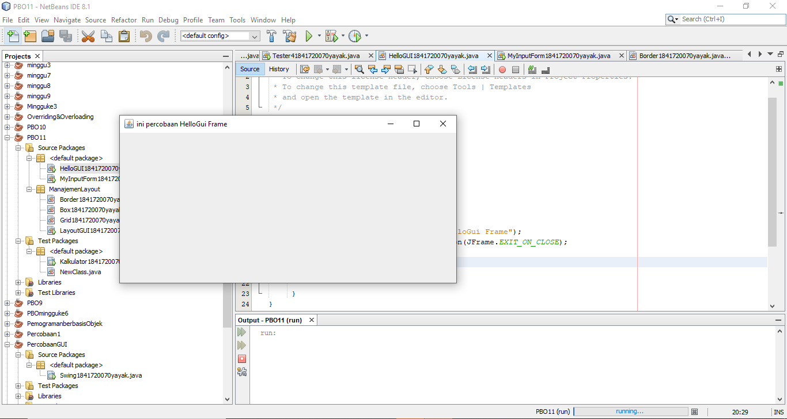
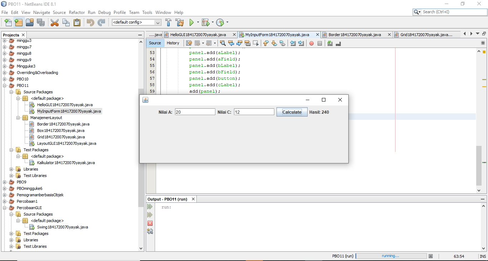
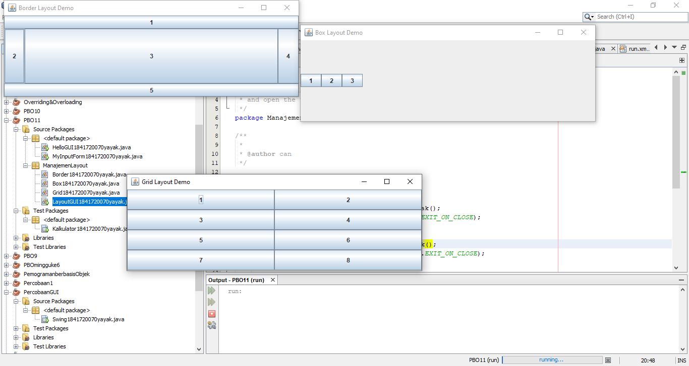
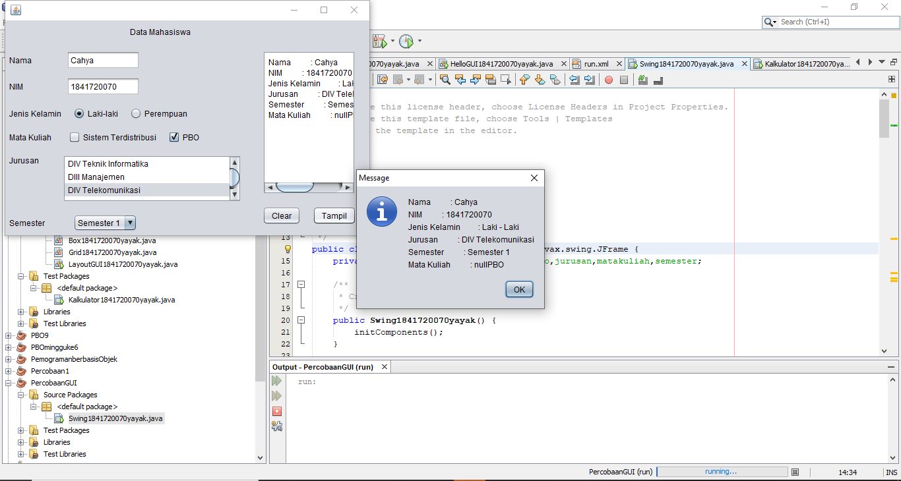
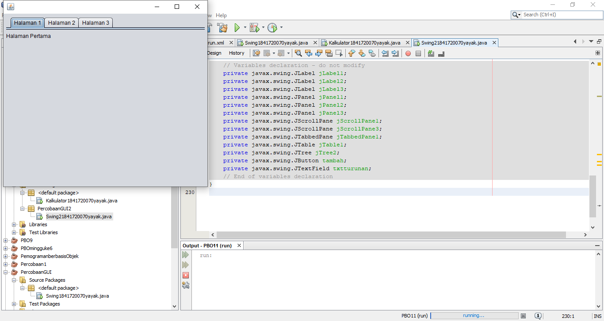
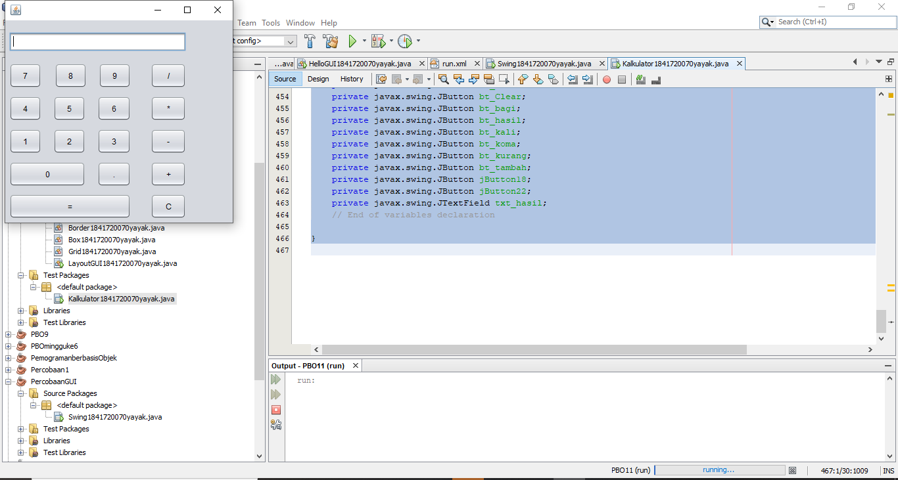

# Laporan Praktikum #11 - GUI

## Kompetensi

Setelah melakukan percobaan pada jobsheet ini, diharapkan mahasiswa mampu:

1. Membuat aplikasi Graphical User Interface sederhana dengan bahasa pemrograman java;

2. Mengenal komponen GUI seperti frame, label, textfield, combobox, radiobutton, checkbox, textarea, menu, serta table;

3. Menambahkan event handling pada aplikasi GUI.

## Ringkasan Materi
- pada jobsheet ini saya menjadi lebih mengetahui mekanisme pembuatan GUI kalkulator Layout dan yang lainnya 

## Percobaan

# Percobaan 1

- Class HelloGUI1841720070yayak.java

Link kode program : [HelloGUI1841720070yayak.java](../../src/11_GUI/HelloGUI1841720070yayak.java)

# Percobaan 2

- Class MyInputForm1841720070yayak.java

Link kode program : [MyInputForm1841720070yayak.java](../../src/11_GUI/MyInputForm1841720070yayak.java)

- Main Class, Tester21841720070yayak.java

## Pertanyaan Percobaan 2

Pertanyaan 
a) Modifikasi kode program dengan menambahkan JButton
 baru untuk melakukan fungsi perhitungan penambahan, sehingga ketika button di klik (event click) maka akan 
menampilkan hasil penambahan dari nilai A dan B
Jawab:--

# Percobaan 3

 

Link kode program : [Grid1841720070yayak](../../src/11_GUI/ManajemenLayout/Grid1841720070yayak.java)

Link kode program : [Box1841720070yayak](../../src/11_GUI/ManajemenLayout/Box1841720070yayak.java)

Link kode program : [Border1841720070yayak](../../src/11_GUI/ManajemenLayout/Border1841720070yayak.java)

Link kode program : [LayoutGUI1841720070yayak](../../src/11_GUI/ManajemenLayout/LayoutGUI1841720070yayak.java)

## Pertanyaan Percobaan 3

a)  Apa perbedaan dari Grid Layout, Box Layout dan Border Layout?

Jawab: Grid Layout : membuat layout dengan satu kolom per komponen, hanya satu baris yang digunakan
Box Layout : menempatkan komponen dalam satu baris atau satu kolom
Border Layout : menyusun komponen berdasarkan lokasi geografis   NORH, SOUTH, WEST, EAST, CENTER

b) Apakah fungsi dari masing-masing kode berikut?

Jawab : Untuk menampilkan class Box
# Percobaan 4

Link kode program : [Swing1841720070yayak](../../src/11_GUI/Swing1841720070yayak.java)

## Pertanyaan Percobaan 4

Pertanyaan 
a) Apakah fungsi dari kode berikut? 

Jawab :menampilkan dari Jframe form
 
b) Mengapa pada bagian logika checkbox dan radio button digunakan multiple if ?

Jawab : Karena , agar ceklis atau raddio buttonnya hanya muncul 1 tanda saja

 c) Lakukan modifikasi pada program untuk melakukan menambahkan inputan berupa alamat dan berikan fungsi pemeriksaan pada nilai Alamat tersebut jika belum diisi dengan menampilkan pesan peringatan 
 
 Jawab :
 
 if (!txtAlamat.equals("")) { 
alamat = txtAlamat.getText().toString(); 
} 
jurusan = listJurusan.getSelectedValue().toString(); semester = comboSemester.getSelectedItem().toString(); 
if (alamat.equals("") || alamat.equals(null)) { JOptionPane.showMessageDialog(null, "Harap isi kolom alamat"); 
} else { 
info = "Nama: " + name + "\n"; 
info += "NIM: " + nim + "\n"; 
info += "Jenis Kelamin: " + jenisKelamin + "\n"; 
info += "Jurusan: " + jurusan + "\n"; 
info += "Semester: " + semester + "\n"; 
info += "Mata Kuliah: " + mataKuliah + "\n"; 
info += "Alamat: " + alamat + ""; 
hasil.setText(info); JOptionPane.showMessageDialog(null, info); 
} 

# Percobaan 5

Link kode program : [Swing21841720070yayak](../../src/11_GUI/Swing21841720070yayak.java)

### PERTANYAAN
a)	Apa kegunaan komponen swing JTabPane, JTtree, pada percobaan 5? 

Jawab : digunakan untuk tampilan atau background nya untuk mengisi pada setiap halaman, JTree digunakan untuk menyimpan pada tambah jika button tambahnya digunakan 

b)	Modifikasi program untuk menambahkan komponen JTable pada tab Halaman 1 dan tab Halaman 2 

Jawab :-

# TUGAS

Link kode program : [Kalkulator1841720070yayak](../../src/11_GUI/Kalkulator1841720070yayak.java)

## Kesimpulan

- interface yang menghubungkan antara user dengan  program dengan tampilan grafis, interface ini dinamakan dengan GUI(Graphical User Interface). 

## Pernyataan Diri

Saya menyatakan isi tugas, kode program, dan laporan praktikum ini dibuat oleh saya sendiri. Saya tidak melakukan plagiasi, kecurangan, menyalin/menggandakan milik orang lain.

Jika saya melakukan plagiasi, kecurangan, atau melanggar hak kekayaan intelektual, saya siap untuk mendapat sanksi atau hukuman sesuai peraturan perundang-undangan yang berlaku.

Ttd,

***(Cahya Abdillah)***

