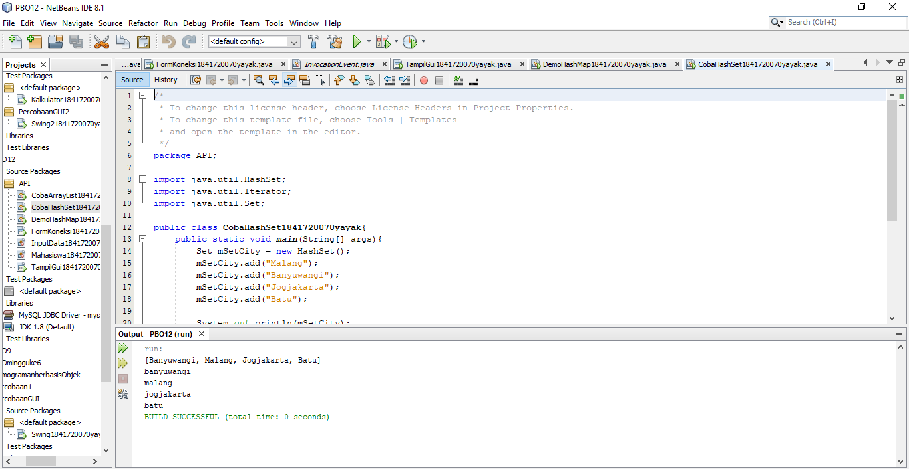
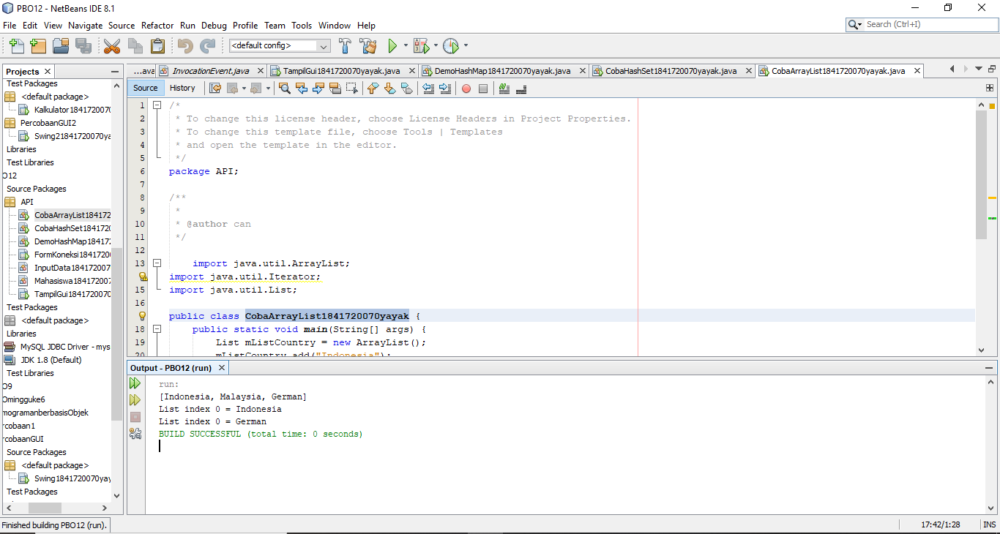
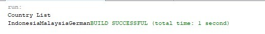
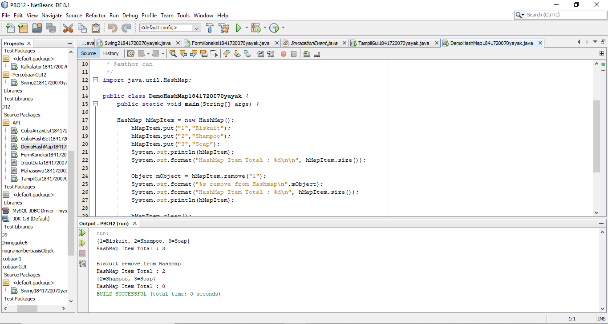
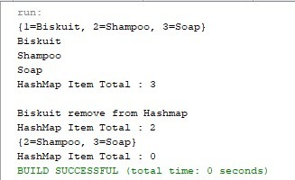
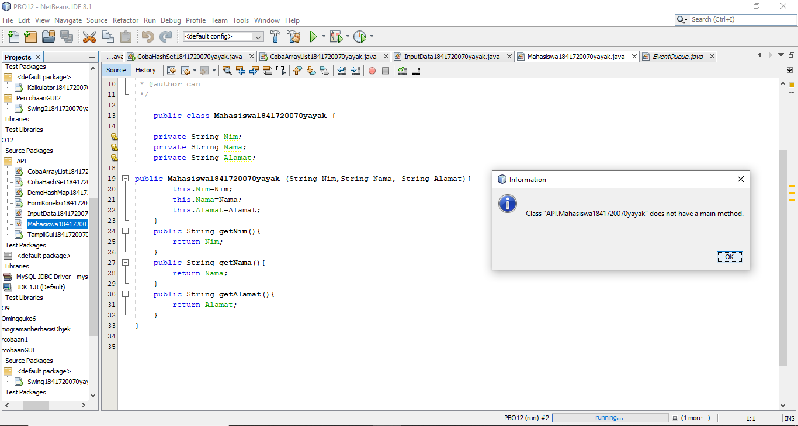
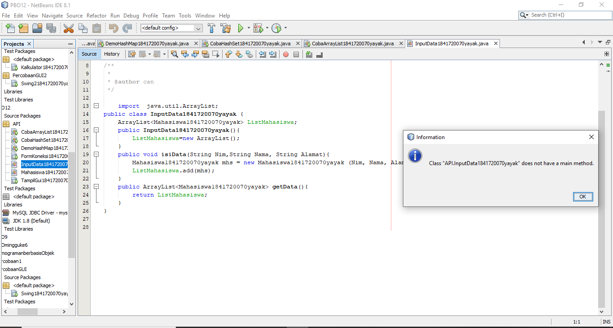
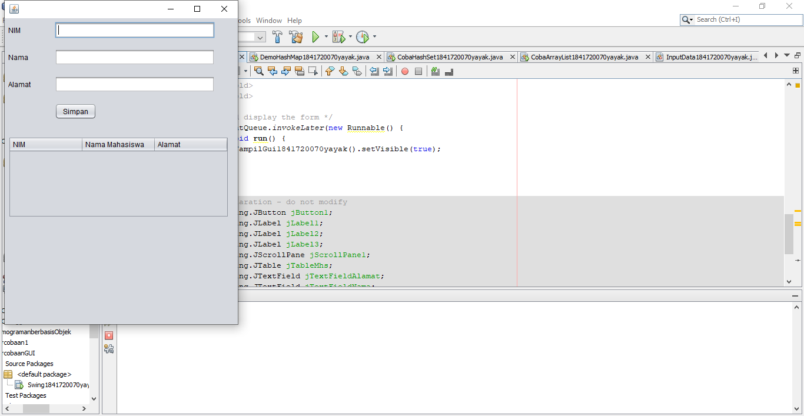
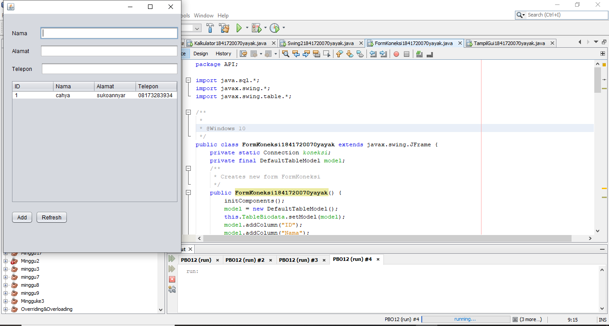

# Laporan Praktikum #11 - GUI

## Kompetensi

- Memahami cara penyimpanan objek menggunakan Collection dan Map. 
- Mengetahui pengelompokan dari Collection.
- Mengetahui perbedaan dari interface Set, List dan Map.
-  Mengetahui penggunaan class-class dari interface Set, List        dan Map.
- Memahami koneksi database menggunakan JDBC dan JDBC API 

## Ringkasan Materi
Collection adalah suatu objek yang bisa digunakan untuk menyimpan sekumpulan objek. Objek yang ada dalam Collection disebut elemen. Collection menyimpan elemen yang bertipe Object, sehingga berbagai tipe object bisa disimpan dalam Collection. Class-class mengenai Collection tergabung dalam Java Collection Framework. Class-class Collection diletakkan dalam package java.util dan mempunyai dua interface utama yaitu Collection.  
 

## Percobaan

# Percobaan 1

- Class CobaHashSet1841720070yayak.java

Link kode program : [CobaHashSet1841720070yayak.java](../../src/12_Java_API/CobaHashSet1841720070yayak.java)

## PERTANYAAN PERCOBAAN 1

1. Apakah fungsi import java.util.*; pada program diatas !
   Jawab :
   Untuk mengimpor semua kelas di dalam java

2. Pada baris program keberapakah yang berfungsi untuk menciptakan object  HashSet? 
   Jawab : pada baris program set set = new HashSet() pada class DemoHashSet

   
  
3. Apakah fungsi potongan program dibawah ini pada percobaan 1! 
   Jawab :
   Untuk mengisi anggota/objek dari suatu Set 
  
4. Tambahkan set.add(“Malang”); kemudian jalankan program! Amati hasilnya    dan jelaskan mengapa terjadi error!
   Jawab :
   Karena pada program tersebut pada baris 26 terdapat fungsi set dimana dia berfungsi untuk menyimpan element-element yang terduplikat. Jadi ketika memanggil nama yang sama, maka yang keluar hanyalah 1 element saja 
    
   
   
5. Jelaskan fungsi potongan program dibawah ini pada percobaan 1
   Jawab :
   fungsi dari potongan program tersebut yaitu pertama dia akan menyimpan isi dari elemen nya sesuai dengan inputan yang di add kan, 
   lalu ketika ada yang double, maka akan di ambil salah satu saja. Lalu, dia akan di panggil ulang dari data array yang sudah di

# Percobaan 2

- CobaArrayList1841720070yayak.java

Link kode program : [CobaArrayList1841720070yayak.java](../../src/12_Java_API/CobaArrayList1841720070yayak.java)

## Pertanyaan Percobaan 2
1. Apakah fungsi potongan program dibawah ini!
   Jawab :
   Untuk menampilkan index array yang ke-2 dan nilai index array yang ke-0 

2. Ganti potongan program pada soal no 1 menjadi sebagai berikut
   Kemudian jalankan program tersebut! 
   Jawab :
   

3. Jelaskan perbedaan menampilkan data pada ArrayList menggunakan            potongan program pada soal no 1 dan no 2!
   Jawab :
   Pada kode pada no.1, hanya menampilkan list country yang dipanggil dari nilai index array yang diminta. Sedangkan kode pada no.2 ,menampilkan seluruh isi dari index array yang ada. 

# Percobaan 3

 

Link kode program : [CobaArrayList1841720070yayak.java](../../src/12_Java_API/CobaArrayList1841720070yayak.java)

## Pertanyaan Percobaan 3

1. Jelaskan fungsi hMapItem.put("1","Biskuit") pada program!

   Jawab : 
   fungsinya yaitu untuk memberikan nilai data pada hashMap.  

2. Jelaskan fungsi hMapItem.size() pada program!

   Jawab :
   untuk menampilkan hasil eksekusi dari data yang sudah di berikan sebelumnya.

3. Jelaskan fungsi hMapItem.remove("1") pada program! 

   Jawab :
   untuk menghapus data Map indeks ke 1

4. Jelaskan fungsi hMapItem.clear() pada program!

   Jawab :
   untuk menghapus semua data yang ada di Map 

5. Tambahkan kode program yang di blok pada program yang sudah anda buat

6. Jalankan program dan amati apa yang terjadi!
   Jawab :

    

   7. Apakah perbedaan program sebelumnya dan setelah ditambahkan kode          program pada soal no 5 diatas? Jelaskan! 
   
   Jawab :

    Perbedaannya yaitu pada program sebelumnya dengan program yang baru dia tidak di tampilkan kembali nilai dari indeks dari masing-masingnya. Sedangkan yang baru dia menampilkan nilai dari indeks masing-masingnya secara vertikal 

# Percobaan 4

Link kode program : [Mahasiswa1841720070yayak.java](../../src/12_Java_API/Mahasiswa1841720070yayak.java)

Link kode program : [InputData1841720070yayak.java](../../src/12_Java_API/InputData1841720070yayak.java)

Link kode program : [TampilGui1841720070yayak.java](../../src/12_Java_API/TampilGui1841720070yayak.java)

# Percobaan 5

Link kode program : [FormKoneksi1841720070yayak.java.java](../../src/12_Java_API/FormKoneksi1841720070yayak.java.java)

## PERTANYAAN 

5. Setelah menambah code pada action button klik, coba jalankan program  dan tambahkan data. Apakah program berhasil menambahkan data? 
   Jikatidak apakah penyebabnya. 
   Jawab :
   Tidak dapat menambah data, karena belum memasukkan library sql di class yang dibuat

6. Jelaskan maksud source code untuk melakukan insert data diatas?
   Jawab :
   Pertama memanggil method buka_koneksi() kemudian melakukan insert data pada sqlkode yang datanya didapat dari inputan melalui fungsi getText(). Kemudian melakukan trycatch yang isinya berupa instansiasi PreparedStatement kemudian melakukan executeUpdate lalu close. jika data berhasil ditambahkan maka akan muncul pesan “Data Berhasil Ditambah” melalui JOptionPane.showMessageDialog jika gagal maka akan muncul pesan “Terjadi Kesalahan” 

  
9. Jelaskan alur dari method ambil_data_tabel? 
   Jawab :
   Pertama memanggil method buka_koneksi() untuk menyambungkan ke database setelah itu executeQuery select , 
   taruh pada object dan getString satu” setealh itu di taruh ke dalam model table 
## Kesimpulan 

- Saya dapat Memahami cara penyimpanan objek menggunakan Collection dan Map.

- Kita dapat Mengetahui pengelompokan dari Collection.

- Kita dapat  perbedaan dari interface Set, List dan Map.

- Kita dapat menerapkan Mengetahui penggunaan class-class dari interface Set, List, dan Map.

- Kita dapat memahami koneksi database menggunakan JDBC dan JDBC API

## Pernyataan Diri

Saya menyatakan isi tugas, kode program, dan laporan praktikum ini dibuat oleh saya sendiri. Saya tidak melakukan plagiasi, kecurangan, menyalin/menggandakan milik orang lain.

Jika saya melakukan plagiasi, kecurangan, atau melanggar hak kekayaan intelektual, saya siap untuk mendapat sanksi atau hukuman sesuai peraturan perundang-undangan yang berlaku.

Ttd,

***(Cahya Abdillah)***

