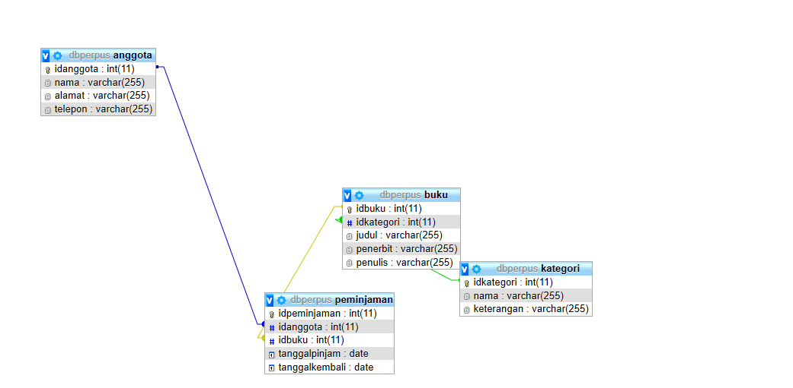
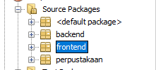
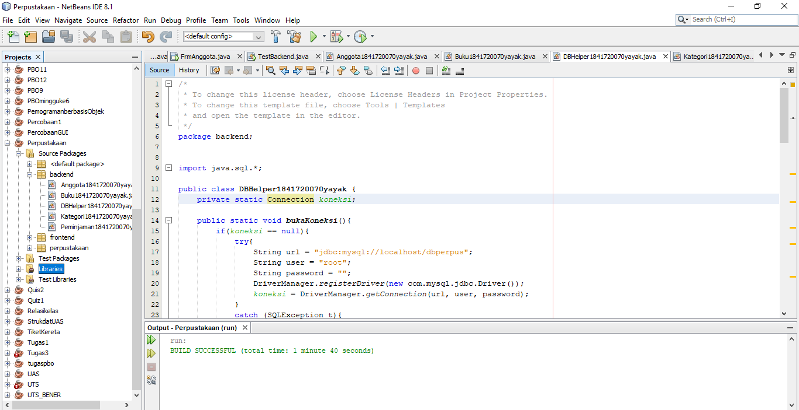
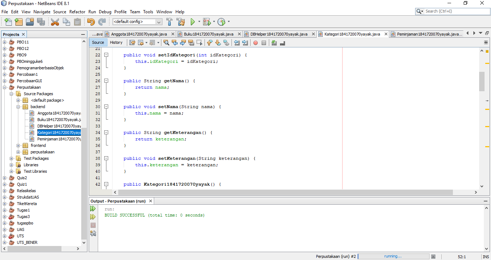
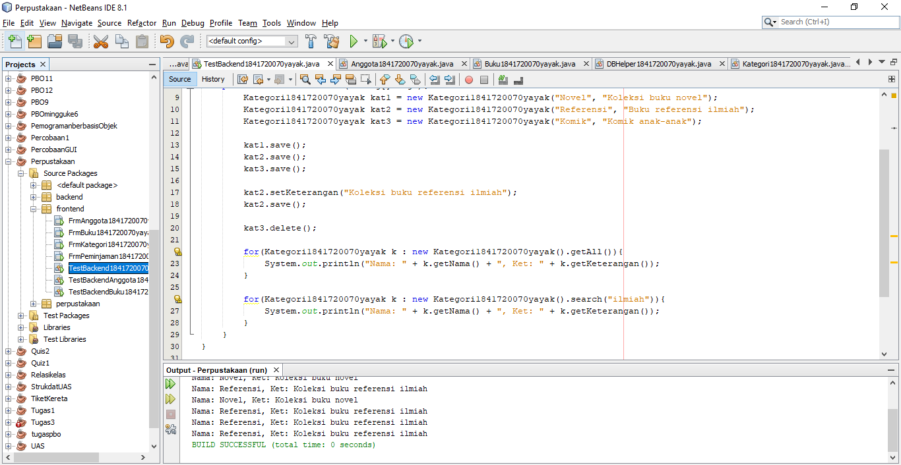
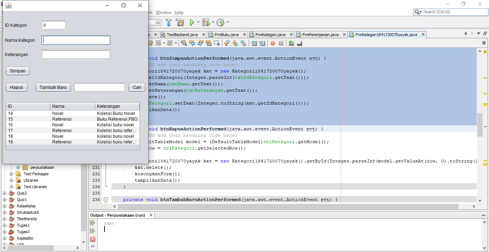
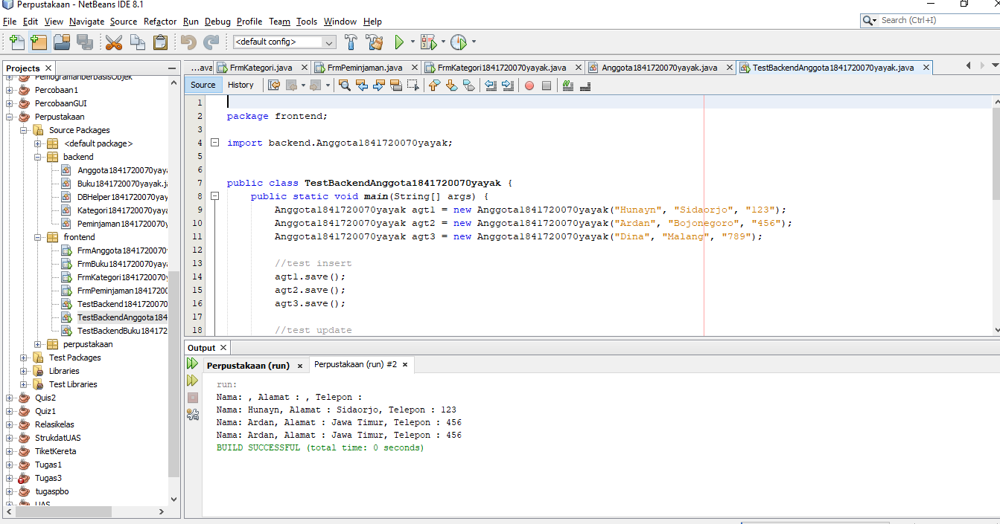
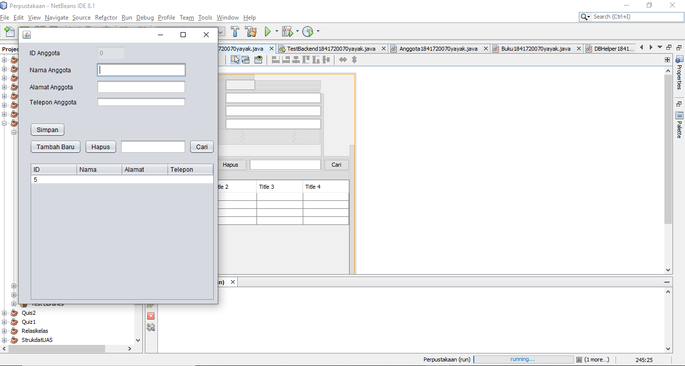
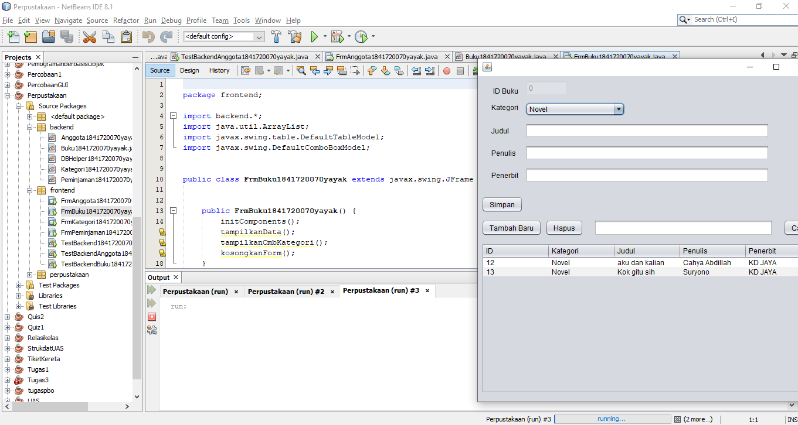
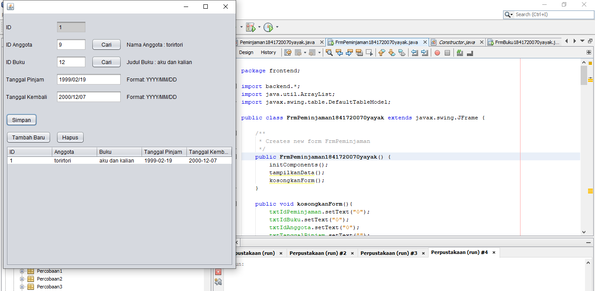

# Laporan Praktikum #14 - GUI dan Database 

## Kompetensi

Setelah menempuh materi percobaan ini, mahasiswa mampu mengenal: 
1. Menggunakan paradigma berorientasi objek untuk interaksi dengan database
 2. Membuat backend dan frontend
 3. Membuat form sebagai frontend 
 
## Ringkasan Materi

## Percobaan

### Percobaan 1

Link kode program : [dbperpus.sql](../../src/14_GUI_dan_Database/dbperpus.sql)

### Percobaan 2

### Percobaan 3

Link kode program: [DBHelper1841720070yayak.java](../../src/14_GUI_dan_Database/backend/DBHelper1841720070yayak.java)

### Percobaan 4

Link kode program: [Kategori1841720070yayak.java](../../src/14_GUI_dan_Database/backend/Kategori1841720070yayak.java)

### Percobaan 5

Link kode program: [TestBackend1841720070yayak.java](../../src/14_GUI_dan_Database/frontend/TestBackend1841720070yayak.java)

### 3.6Percobaan 6

Link kode program: [FrmKategori1841720070yayak.java](../../src/14_GUI_dan_Database/frontend/FrmKategori1841720070yayak.java)

### 3.6Percobaan 6

Link kode program: [Anggota1841720070yayak.java](../../src/14_GUI_dan_Database/backend/Anggota1841720070yayak.java)

### 3.7Percobaan 7

Link kode program: [FrmAnggota1841720070yayak.java](../../src/14_GUI_dan_Database/frontend/FrmAnggota1841720070yayak.java)

### 3.7Percobaan 7

Link kode program:[Buku1841720070yayak.java](../../src/14_GUI_dan_Database/backend/Buku1841720070yayak.java)

### 3.8Percobaan 8

Link kode program: [Buku1841720070yayak.java](../../src/14_GUI_dan_Database/backend/Kategori1841720070yayak.java)

Link kode program: [FrmBuku1841720070yayak.java](../../src/14_GUI_dan_Database/frontend/FrmBuku1841720070yayak.java)

### Tugas

## Kesimpulan
 kita akan membuat sistem informasi Perpustakaan, yang memiliki data antara lain: Buku, Kategori, Anggota dan Peminjaman. Fitur yang ada pada aplikasi ini adalah anggota dapat melakukan peminjaman dan pengembalian buku.

## Pernyataan Diri

Saya menyatakan isi tugas, kode program, dan laporan praktikum ini dibuat oleh saya sendiri. Saya tidak melakukan plagiasi, kecurangan, menyalin/menggandakan milik orang lain.

Jika saya melakukan plagiasi, kecurangan, atau melanggar hak kekayaan intelektual, saya siap untuk mendapat sanksi atau hukuman sesuai peraturan perundang-undangan yang berlaku.

Ttd,

***(Cahya Abdillah)***

