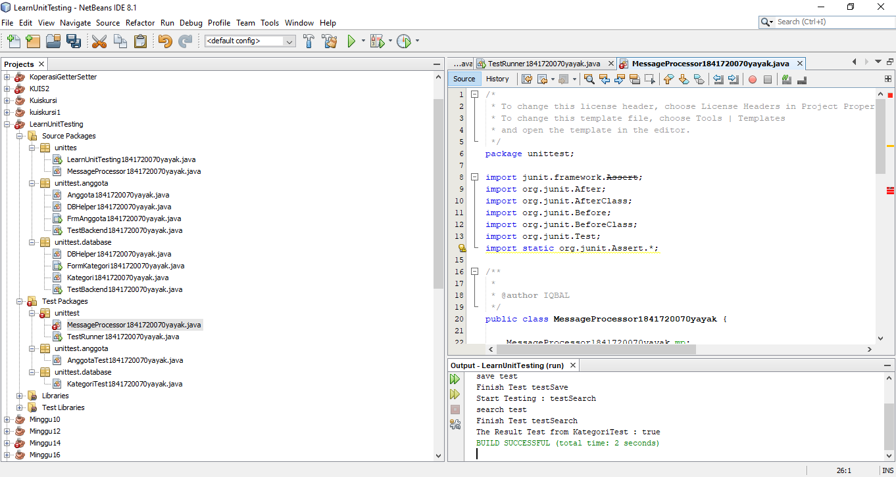

# Laporan Praktikum #15 - Unit Testing 

## Kompetensi

1. Memahami konsep dan fungsi unit testing 
2. Menerapkan unit testing dengan JUnit pada program sederhana. 
3. Menerapkan unit testing dengan JUnit pada progam yang terkoneksi database 
 
## Ringkasan Materi

## Percobaan

### Percobaan 1

Link kode program : [LearnUnitTesting](../../src/15_Unit_Testing/unittes/LearnUnitTesting.java)

Link kode program : [MessageProcessor](../../src/15_Unit_Testing/unittes/MessageProcessor.java)

### Percobaan 2

Link kode program : [FormKategori1841720070yayak](../../src/15_Unit_Testing/unittest/database/FormKategori1841720070yayak.java)

Link kode program : [Kategori1841720070yayak](../../src/15_Unit_Testing/unittest/database/Kategori1841720070yayak.java)

Link kode program : [DBHelper1841720070yayak](../../src/15_Unit_Testing/unittest/database/DBHelper1841720070yayak.java)

Link kode program : [TestBackend1841720070yayak](../../src/15_Unit_Testing/unittest/database/TestBackend1841720070yayak.java)

Link kode program : [MessageProcessor1841720070yayak](../../src/15_Unit_Testing/test/unittest/MessageProcessor1841720070yayak.java)

Link kode program : [TestRunner1841720070yayak](../../src/15_Unit_Testing/test/unittest/TestRunner1841720070yayak.java)

Link kode program : [Kategori1841720070yayak](../../src/15_Unit_Testing/test/unittest/KategorTesti1841720070yayak.java)

### TUGAS

Link kode program : [Anggota1841720070yayak](../../src/15_Unit_Testing/unittest/anggota/Anggota1841720070yayak.java)

Link kode program : [DBHelper1841720070yayak](../../src/15_Unit_Testing/unittest/anggota/DBHelper1841720070yayak.java)

Link kode program : [FrmAnggota1841720070yayak](../../src/15_Unit_Testing/unittest/anggota/FrmAnggota1841720070yayak.java)

Link kode program : [TestBackend1841720070yayak](../../src/15_Unit_Testing/unittest/anggota/TestBackend1841720070yayak.java)

Link kode program : [AnggotaTest1841720070yayak](../../src/15_Unit_Testing/test/unittest/anggota/AnggotaTest1841720070yayak.java)

## Kesimpulan
 
 membuat sebuah program sederhana yang mengilustrasikan sebuah aplikasi pengiriman pesan. Pada program tersebut terdapat satu class utama dimana didalamnya terdapat beberapa method sederhana yang nantinya akan dibuatkan unit test-nya.

## Pernyataan Diri

Saya menyatakan isi tugas, kode program, dan laporan praktikum ini dibuat oleh saya sendiri. Saya tidak melakukan plagiasi, kecurangan, menyalin/menggandakan milik orang lain.

Jika saya melakukan plagiasi, kecurangan, atau melanggar hak kekayaan intelektual, saya siap untuk mendapat sanksi atau hukuman sesuai peraturan perundang-undangan yang berlaku.

Ttd, 

***(Cahya Abdillah)***