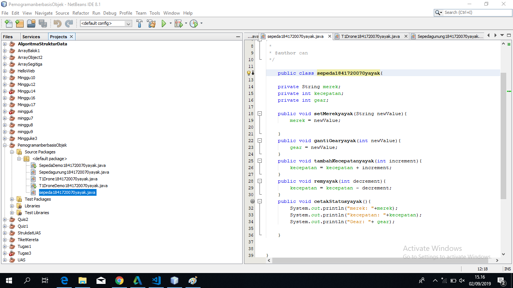

# Laporan Praktikum #1 - Pengantar Konsep PBO

## Kompetensi

(Pengantar Konsep Pemrograman Berorientasi Objek )

## Ringkasan Materi

(kumpulan atas definisi data dan fungsi-fungsi dalam suatu unit untuk suatu tujuan tertentu. Sebagai contoh 'class of dog' adalah suatu unit yang terdiri atas definisi-definisi data dan fungsi-fungsi yang menunjuk pada berbagai macam perilaku/turunan dari anjing. Sebuah class adalah dasar dari modularitas dan struktur dalam pemrograman berorientasi object. Sebuah class secara tipikal sebaiknya dapat dikenali oleh seorang non-programmer sekalipun terkait dengan domain permasalahan yang ada, dan kode yang terdapat dalam sebuah class sebaiknya (relatif) bersifat mandiri dan independen (sebagaimana kode tersebut digunakan jika tidak menggunakan OOP). Dengan modularitas, struktur dari sebuah program akan terkait dengan aspek-aspek dalam masalah yang akan diselesaikan melalui program tersebut. Cara seperti ini akan menyederhanakan pemetaan dari masalah ke sebuah program ataupun sebaliknya)

## Percobaan

### Percobaan 1

(Saya mengetahui rumus yang menyatakan penambahan kecepatan pengeriman dan penambahan )

`contoh screenshot yang benar, menampilkan 3 komponen, yaitu struktur project, kode program, dan hasil kompilasi`

Contoh link kode program : [ini contoh link ke kode program](D:\KULIAH\SEMESTER 3\DesProWeb\laporan-praktikum-pbo-master\src\1_Pengantar_Konsep_PBO\sepeda1841720070yayak)

### Percobaan 2

(berisi turunan tetapi disini kasusnya ialah suspensi karena sepeda biasa dan sepeda gunung perbedaan terdapat dalam suspensi yang jauh bagus karena ada seperti kasta)

`contoh screenshot yang benar, menampilkan 3 komponen, yaitu struktur project, kode program, dan hasil kompilasi`

Contoh link kode program : [ini contoh link ke kode program](D:\KULIAH\SEMESTER 3\DesProWeb\laporan-praktikum-pbo-master\src\1_Pengantar_Konsep_PBO\.java)

## Pertanyaan

(1. Sebutkan dan jelaskan aspek-aspek yang ada pada pemrograman berorientasi objek!
Jawab: Object adalah suatu rangkaian dalam program yang terdiri dari state dan behaviour. Object pada software dimodelkan sedemikian rupa sehingga mirip dengan objek yang ada di dunia nyata.

Class  adalah blueprint atau prototype dari objek. Ambil contoh objek sepeda. Terdapat berbagai macam sepeda di dunia, dari berbagai merk dan model. 

Enkapsulasi Disebut juga dengan information-hiding. Dalam berinteraksi dengan objek, seringkali kita tidak perlu mengetahui kompleksitas yang ada didalamnya

Inheritance Disebut juga pewarisan. Inheritance memungkinkan kita untuk mengorganisir struktur program dengan natural. Inheritance juga memungkinkan kita untuk memperluas fungsionalitas program tanpa harus mengubah banyak bagian program. Contoh di dunia nyata, objek sepeda dapat diturunkan lagi ke model yang lebih luas, misal sepeda gunung (mountain bike) dan road bike.

Polimorfisme Polimorfisme juga meniru sifat objek di dunia nyata, dimana sebuah objek dapat memiliki bentuk, atau menjelma menjadi bentuk-bentuk lain. Misalkan saja objek pesawat terbang. Objek ini dapat diwariskan menjadi pesawat jet dan pesawat baling-baling. Keduanya memiliki kemampuan untuk menambah kecepatan. Namun secara teknis, metode penambahan kecepatan antara pesawat jet dengan baling-baling tentu berbeda, karena masing-masing memiliki jenis mesin yang berbeda. 

 2. Apa yang dimaksud dengan object dan apa bedanya dengan class?
 Jawab:Kelas ialah kumpulan atas definisi data dan fungsi fungsi dalam suatu unit.

 Object ialah membungkus data dan fungsi bersama menjadi suatu unit dalam sebuah program komputer, objek merupakan dasar dari modularitas dan struktur dalam sebuah program komputer  berorientasi objek 

    3. Sebutkan salah satu kelebihan utama dari pemrograman
     berorientasi objek dibandingkan dengan pemrograman struktural!
     Jawab: Adanya  konsistensi karena sifat inhantance dan penggunaan fase yang sama pada saat menganalisis,merancang maupun coding

  4. Pada class Sepeda, terdapat state/atribut apa saja?
   Jawab: Decrement,increment,newValue

  5. Tambahkan atribut warna pada class Sepeda.
   Jawab:(D:\KULIAH\SEMESTER 3\DesProWeb\laporan-praktikum-pbo-master\src\1_Pengantar_Konsep_PBO\)
  6. Mengapa pada saat kita membuat class SepedaGunung, kita tidak perlu membuat class nya dari nol?
  Jawab: Karena kita sudah memanggil fungsi dari extands yang terdapat pada SepedaGunung
   )

## Tugas

Contoh link kode program : [ini contoh link ke kode program](D:\KULIAH\SEMESTER 3\DesProWeb\laporan-praktikum-pbo-master\src\1_Pengantar_Konsep_PBO/SepedaDemo1841720070yayak)

## Kesimpulan

(telah menjadi standar dalam dunia pemrograman, termasuk PHP. Walaupun kita bisa membuat program PHP tanpa menggunakan OOP sama sekali, namun untuk membuat aplikasi ‘real world’ yang fleksibel, programmer PHP akan beralih menggunakan OOP. )

## Pernyataan Diri

Saya menyatakan isi tugas, kode program, dan laporan praktikum ini dibuat oleh saya sendiri. Saya tidak melakukan plagiasi, kecurangan, menyalin/menggandakan milik orang lain.

Jika saya melakukan plagiasi, kecurangan, atau melanggar hak kekayaan intelektual, saya siap untuk mendapat sanksi atau hukuman sesuai peraturan perundang-undangan yang berlaku.

Ttd,

***(Cahya Abdillah)***