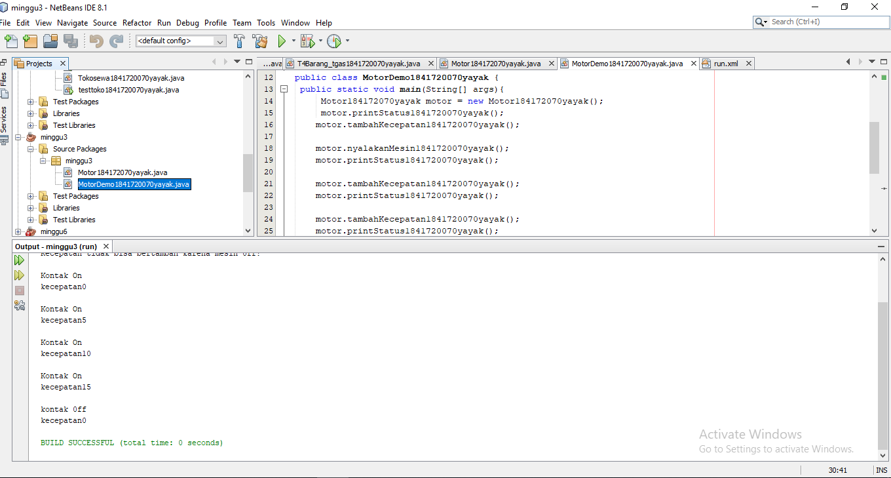
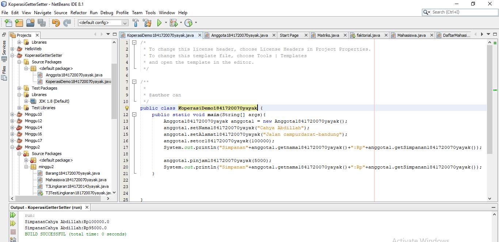
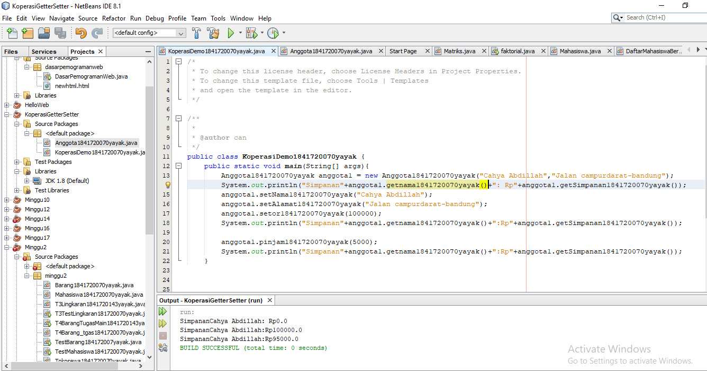
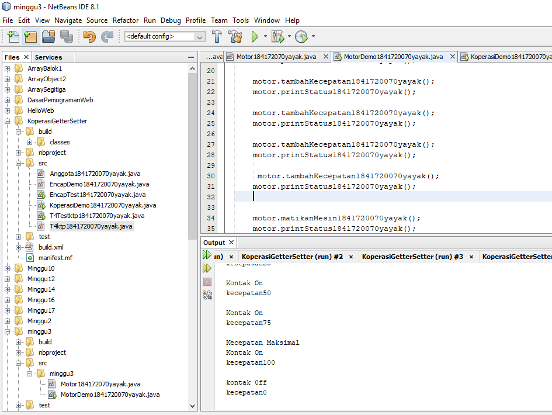

# Laporan Praktikum #3- Pengantar Konsep PBO

## Kompetensi

(Pengantar Konsep Pemrograman Berorientasi Objek )

## Ringkasan Materi

(Suatu cara untuk menyembunyikan implementasi detail dari suatu classenkapsulasi mempunyai 2 hal mendasar,yaitu information hidding serta method(interface)to acces data ) 
## Percobaan

### Percobaan 1

(Saya mengetahui rumus yang menyatakan penambahan kecepatan pengeriman dan penambahan )

`contoh screenshot yang benar, menampilkan 3 komponen, yaitu struktur project, kode program, dan hasil kompilasi`

Contoh link kode program : [MotorDemo1841720070yayak](../../src/3_Enkapsulasi/MotorDemo1841720070yayak.java)

Contoh link kode program : [Motor1841720070yayak](../../src/3_Enkapsulasi/Motor1841720070yayak.java)

### Percobaan 2

(berisi turunan tetapi disini kasusnya ialah suspensi karena sepeda biasa dan sepeda gunung perbedaan terdapat dalam suspensi yang jauh bagus karena ada seperti kasta)

`contoh screenshot yang benar, menampilkan 3 komponen, yaitu struktur project, kode program, dan hasil kompilasi`

Contoh link kode program : [MotorDemo1841720070yayak](../../src/3_Enkapsulasi/MotorDemo1841720070yayak.java)

Contoh link kode program : [Motor1841720070yayak](../../src/3_Enkapsulasi/Motor184172070yayak.java)

### Percobaan 3

(berisi turunan tetapi disini kasusnya ialah suspensi karena sepeda biasa dan sepeda gunung perbedaan terdapat dalam suspensi yang jauh bagus karena ada seperti kasta)

`contoh screenshot yang benar, menampilkan 3 komponen, yaitu struktur project, kode program, dan hasil kompilasi`

Contoh link kode program : [KoperasiDemo1841720070yayak](../../src/3_Enkapsulasi/KoperasiDemo1841720070yayak.java)

Contoh link kode program : [Anggota1841720070yayak](../../src/3_Enkapsulasi/Anggota1841720070yayak.java)

### Percobaan 4

(berisi turunan tetapi disini kasusnya ialah suspensi karena sepeda biasa dan sepeda gunung perbedaan terdapat dalam suspensi yang jauh bagus karena ada seperti kasta)

`contoh screenshot yang benar, menampilkan 3 komponen, yaitu struktur project, kode program, dan hasil kompilasi`

 [KoperasiDemo1841720070yayak](../../src/3_Enkapsulasi/KoperasiDemo1841720070yayak)

[Anggota1841720070yayak](../../src/3_Enkapsulasi/Anggota1841720070yayak.java)

3.3 Pertanyaan
1. Pada class TestMobil, saat kita menambah kecepatan untuk pertama kalinya, mengapa muncul peringatan “Kecepatan tidak bisa bertambah karena Mesin Off!”? 
Jawab:Karena tertera kontakOn== false syntax tersebut akan berjalan

2. Mengapat atribut kecepatan dan kontakOn diset private? 
 Jawab :supaya atribut tersebut di akses di class sama 
3. Ubah class Motor sehingga kecepatan maksimalnya adalah 100!
jawab : 

[MotorDemo1841720070yayak](../../src/3_Enkapsulasi/MotorDemo1841720070yayak.java)

[Motor1841720070yayak](../../src/3_Enkapsulasi/Motor1841720070yayak.java)

## Pertanyaan

1. Apa yang dimaksud getter dan setter?
  Jawab : data bersifat private yang tidak bisa diakses dari luar dan dua method ini bersifat mengambil dan mengisi data dalam objek
  2. Apa kegunaan dari method getSimpanan()? 
   Jawab:untuk menampilkan simpanan melalui getSimpanan()
  3.Method apa yang digunakan untuk menambah saldo? 
   jawab:public void setor1841720070yayak(float uang)
  4. Apa yand dimaksud konstruktor?
   jawab:method khusus yang akan di jalankan secara otomatis pada objek 
   5. Sebutkan aturan dalam membuat konstruktor?
   jawab: biasanya untuk membuat proses awal dalam mempersiapkan objek, seperti memberi nilai awal kepada property method internal dan beberapa proses lain yang digunakan untuk ‘mempersiapkan’ objek.
  6. Apakah boleh konstruktor bertipe private?
     jawab: Tidak,karena konstruktor bukan untuk private selalu di panggil
  7. Kapan menggunakan parameter dengan passsing parameter?
     Jawab:saat konstruktor mempunyai parameter
  8. Apa perbedaan atribut class dan instansiasi atribut?
      jawab:atribut clas mempunyai nilai dalam suatu class,kalau instansi ialah tugasnya memanggil class yang berbeda pada class lain
  9. Apa perbedaan class method dan instansiasi method?
       Jawab: class method ialah method yang sudah tersedia di dalam  class yang berbeda

## Tugas

## Tugas 1
![Contoh screenshot]

 [EncapTest1841720070yayak](../../src/3_Enkapsulasi/EncapTest1841720070yayak.java)

 [EncapDemo1841720070yayak](../../src/3_Enkapsulasi/EncapDemo1841720070yayak.java)

## Tugas 2
Pada program diatas, pada class EncapTest kita mengeset age dengan nilai 35, namun pada saat ditampilkan ke layar nilainya 30, jelaskan mengapa

Jawab : karena pada method set age terdapat if(newage>30)
age = 30 jadi 35 adalah lebih dari 30 dan karena persyaratan tersebut terpenuhi maka akan menjadi 30

## Tugas 3

[EncapDemo1841720070yayak](../../src/3_Enkapsulasi/EncapDemo1841720070yayak.java)

[EncapTest1841720070yayak](../../src/3_Enkapsulasi/EncapTest1841720070yayak.java)

## Tugas 4

[T4ktp1841720070yayak](../../src/3_Enkapsulasi/T4ktp1841720070yayak.java)

[T4Testktp1841720070yayak](../../src/3_Enkapsulasi/T4Testktp1841720070yayak.java)

## Tugas 5

[T4ktp1841720070yayak](../../src/3_Enkapsulasi/T4ktp1841720070yayak.java)

[T4Testktp1841720070yayak](../../src/3_Enkapsulasi/T4Testktp1841720070yayak.java)

## Tugas 6

[T4ktp1841720070yayak](../../src/3_Enkapsulasi/T4ktp1841720070yayak.java)

[T4Testktp1841720070yayak](../../src/3_Enkapsulasi/T4Testktp1841720070yayak.java)
## Kesimpulan

(ada 4 kosep dari enkapsulasi, kontruktor, access modifier yang terdiri dari 4 jenis yaitu public, protected, default dan private. Konsep atribut atau method class masing masing mempunyai peran yang sangat andil. )

## Pernyataan Diri

Saya menyatakan isi tugas, kode program, dan laporan praktikum ini dibuat oleh saya sendiri. Saya tidak melakukan plagiasi, kecurangan, menyalin/menggandakan milik orang lain.

Jika saya melakukan plagiasi, kecurangan, atau melanggar hak kekayaan intelektual, saya siap untuk mendapat sanksi atau hukuman sesuai peraturan perundang-undangan yang berlaku.

Ttd,

***(Cahya Abdillah)***