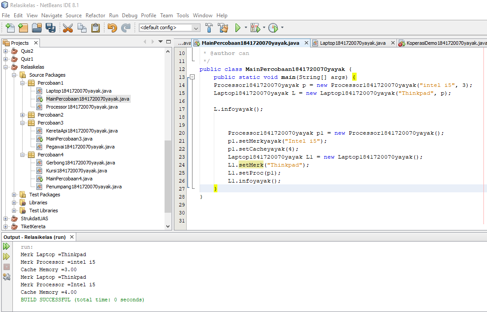

<<<<<<< HEAD
# Laporan Praktikum #3- Pengantar Konsep PBO
=======
# Laporan Praktikum #4-Relasi_Class
>>>>>>> 039777f585ae00e1a830a9a1fe783a0d451a4ecc

## Kompetensi

(Pengantar Konsep Pemrograman Berorientasi Objek )

## Ringkasan Materi

pada kasus yang lebih kompleks, dalam suatu sistem akan ditemukan lebih dari satu class yang saling memiliki keterkaitan antara class satu dengan yang lain. Pada percobaan‑percobaan sebelumnya, mayoritas kasus yang sudah dikerjakan hanya fokus pada satu class saja. Pada jobsheet ini akan dilakukan percobaan yang melibatkan beberapa class yang saling berelasi. 

Relasi dalam class dinyatakan dalam one‑to‑one. Tetapi ada kalanya relasi class melibatkan lebih dari satu. Hal ini disebut dengan multiplicity. Untuk relasi lebih rinci mengenai multiplicity, dapat dilihat pada tabel berikut. 
 

III. Praktikum 
 
## Percobaan

### Percobaan 1

(Saya mengetahui rumus yang menyatakan penambahan kecepatan pengeriman dan penambahan )

`contoh screenshot yang benar, menampilkan 3 komponen, yaitu struktur project, kode program, dan hasil kompilasi`

<<<<<<< HEAD

=======

>>>>>>> 039777f585ae00e1a830a9a1fe783a0d451a4ecc

Contoh link kode program : [MainPercobaan1841720070yayak](../../src/4_Relasi_Class/MainPercobaan1841720070yayak.java)

Contoh link kode program : [Laptop1841720070yayak](../../src/4_Relasi_Class/Laptop1841720070yayak.java)

Contoh link kode program : [Processor1841720070yayak](../../src/4_Relasi_Class/Processor1841720070yayak.java)

Pertanyaan Berdasarkan percobaan 1,
 jawablah pertanyaan‑pertanyaan yang terkait: 
 1. Di dalam class Processor dan class Laptop , terdapat method setter dan getter untuk masing‑masing atributnya. Apakah gunanya method setter dan getter tersebut ?
 Jawab:
  Method setter untuk mengeset nilai dari class sedangkan method getter untuk mendapatkan nilai dari atribut class

  2. Di dalam class Processor dan class Laptop, masing‑masing terdapat konstruktor default dan konstruktor berparameter. Bagaimanakah beda penggunaan dari kedua jenis konstruktor tersebut ? 
Jawab:
Perbedaan dari kedua konstruktur tersebut adalah salah satu nya memiliki parameter dan mengeset nilai atribut pada saat instansiasi, sedangkan yg satunya merupakan konstruktor default 
 
3. Perhatikan class Laptop, di antara 2 atribut yang dimiliki (merk dan proc), atribut manakah yang bertipe object ?
Jawab :
- Atribur proc
 4. Perhatikan class Laptop, pada baris manakah yang menunjukan bahwa class Laptop memiliki relasi dengan class Processor ? 

 - private Processor1841720123yayak proc;
 5. Perhatikan pada class Laptop , Apakah guna dari sintaks proc.info() ? 
 Untuk memanggil method infoyayak() yang ada pada atribut proc
 6. Pada class MainPercobaan1, terdapat baris kode: Laptop l = new Laptop("Thinkpad", p);. Apakah p tersebut ? Dan apakah yang terjadi jika baris kode tersebut diubah menjadi: Laptop l = new Laptop("Thinkpad", new Processor("Intel i5", 3)); Bagaimanakah hasil program saat dijalankan, apakah ada perubahan ? 
 p adalah objek dari processor, sama saja tidak ada perubahan 

 
 

### Percobaan 2

(berisi turunan tetapi disini kasusnya ialah suspensi karena sepeda biasa dan sepeda gunung perbedaan terdapat dalam suspensi yang jauh bagus karena ada seperti kasta)

`contoh screenshot yang benar, menampilkan 3 komponen, yaitu struktur project, kode program, dan hasil kompilasi`

<<<<<<< HEAD

=======

>>>>>>> 039777f585ae00e1a830a9a1fe783a0d451a4ecc

Contoh link kode program : [MainPercobaan21841720070yayak](../../src/4_Relasi_Class/MainPercobaan21841720070yayak.java)

Contoh link kode program : [Mobil1841720070yayak](../../src/4_Relasi_Class/Mobil1841720070yayak.java)

Contoh link kode program : [Mobil1841720070yayak](../../src/4_Relasi_Class/Mobil1841720070yayak.java)

Contoh link kode program : [Pelanggan1841720070yayak](../../src/4_Relasi_Class/Pelanggan1841720070yayak.java)

Contoh link kode program : [Pelanggan1841720070yayak](../../src/4_Relasi_Class/Pelanggan1841720070yayak.java)

Contoh link kode program : [Sopir1841720070yayak](../../src/4_Relasi_Class/Sopir1841720070yayak.java)

Pertanyaan 
 
1. Perhatikan class Pelanggan. Pada baris program manakah yang menunjukan bahwa class Pelanggan memiliki relasi dengan class Mobil dan class Sopir ? 
 Jawab:
 Untuk memanggil method infoyayak() yang berada di dalam objek masinis dan asisten untuk menampilkan info dari onjek tersebut

2. Perhatikan method hitungBiayaSopir pada class Sopir, serta method hitungBiayaMobil pada class Mobil. Mengapa menurut Anda method tersebut harus memiliki argument hari ?

Pegawai masinis = new Pegawai("1234", "Spongebob Squarepants"); KeretaApi keretaApi = new KeretaApi("Gaya Baru", "Bisnis", masinis); 

 
3. Perhatikan kode dari class Pelanggan. Untuk apakah perintah mobil.hitungBiayaMobil(hari) dan sopir.hitungBiayaSopir(hari) ? 
Karena pada method hitungBayarSopiryayak diperlukan sejumlah hari untuk menghitung hasil biaya. Sedangkan argumen hari merupakan nilai yang ditentukan oleh user, bukan oleh objek itu sendiri
Karena pada pemanggilan method infoyayak(), methodnya membutuhkan objek masinis, 

4. Perhatikan class MainPercobaan2. Untuk apakah sintaks p.setMobil(m) dan p.setSopir(s) ?

 Untuk mendapatkan masing-masing biaya sewa mobil dan biaya sewa sopir

 5. Perhatikan class MainPercobaan2. Untuk apakah proses p.hitungBiayaTotal() tersebut ?
   Untuk menghitung biaya total yang didapatkan dari penjumlahan biaya sewa mobil dan biaya sewa sopir

 6. Perhatikan class MainPercobaan2, coba tambahkan pada baris terakhir dari method main dan amati perubahan saat di‑run! 
  Untuk mendapatkan nama merk dari mobil yang menjadi atribut dari objek p(penumpang)
 
System.out.println(p.getMobil().getMerk()); 

### Percobaan 3

(berisi turunan tetapi disini kasusnya ialah suspensi karena sepeda biasa dan sepeda gunung perbedaan terdapat dalam suspensi yang jauh bagus karena ada seperti kasta)

`contoh screenshot yang benar, menampilkan 3 komponen, yaitu struktur project, kode program, dan hasil kompilasi`

Contoh link kode program : [KeretaApi1841720070yayak](../../src/4_Relasi_Class/KeretaApi1841720070yayak.java)

Contoh link kode program : [MainPercobaan3](../../src/4_Relasi_Class/MainPercobaan3.java)

Contoh link kode program : [Pegawai1841720070yayak](../../src/4_Relasi_Class/Pegawai1841720070yayak.java)

### Pertanyaan Percobaan 3

1. Di dalam method info() pada class KeretaApi, baris this.masinis.info() dan this.asisten.info() digunakan untuk apa ? 
 private Mobil1841720070yayak mobil;
    private Sopir1841720070yayak sopir;
Jawab: Untuk memanggil method infoyayak() yang berada di dalam objek masinis dan asisten untuk menampilkan info dari onjek tersebut

2. Buatlah main program baru dengan nama class MainPertanyaan pada package yang sama. Tambahkan kode berikut pada method main() ! 
 Jawab:

Pegawai masinis = new Pegawai("1234", "Spongebob Squarepants"); KeretaApi keretaApi = new KeretaApi("Gaya Baru", "Bisnis", masinis); 

3. Apa hasil output dari main program tersebut ? Mengapa hal tersebut dapat terjadi ? 
- Karena pada pemanggilan method infoyayak(), methodnya membutuhkan objek masinis, 
4. Perbaiki class KeretaApi sehingga program dapat berjalan !
### Percobaan 4

(berisi turunan tetapi disini kasusnya ialah suspensi karena sepeda biasa dan sepeda gunung perbedaan terdapat dalam suspensi yang jauh bagus karena ada seperti kasta)

`contoh screenshot yang benar, menampilkan 3 komponen, yaitu struktur project, kode program, dan hasil kompilasi`

<<<<<<< HEAD

=======

>>>>>>> 039777f585ae00e1a830a9a1fe783a0d451a4ecc

 Contoh link kode program : [MainPercobaan4](../../src/4_Relasi_Class/MainPercobaan4.java)

 Contoh link kode program : [Gerbong1841720070yayak](../../src/4_Relasi_Class/Gerbong1841720070yayak.java)

 Contoh link kode program : [Kursi1841720070yayak](../../src/4_Relasi_Class/Kursi1841720070yayak.java)

 Contoh link kode program : [Penumpang1841720070yayak](../../src/4_Relasi_Class/Penumpang1841720070yayak.java)

## Pertanyaan

1. Pada main program dalam class MainPercobaan4, berapakah jumlah kursi dalam Gerbong A ?
Jawab:
 - Jumlah kursi dalam Gerbong A ada 10 kursi

2. Perhatikan potongan kode pada method info() dalam class Kursi. Apa maksud kode tersebut ?
jawab:
 Maksud dari kode tersebut adalah, jika penumpang tidak kosong maka akan dikeluarkan data pada class Penumpang di method infoyayak()

 
... if (this.penumpang != null) { info += "Penumpang: " + penumpang.info() + "\n"; } ... 
 
3. Mengapa pada method setPenumpang() dalam class Gerbong, nilai nomor dikurangi dengan angka 1 ?

JAWAB: Nilai nomor dikurangi dengan angka 1 pada method setPenumpangyayak() dikarenakan index array dimulai dari angka 0

4. Instansiasi objek baru budi dengan tipe Penumpang, kemudian masukkan objek baru tersebut pada gerbong dengan gerbong.setPenumpang(budi, 1). Apakah yang terjadi ? 
Jawab:
Yang terjadi ialah, data budi  keluar  tetapi  kursi yang telah digunakan oleh orang lain

5. Modifikasi program sehingga tidak diperkenankan untuk menduduki kursi yang sudah ada penumpang lain ! 
 
 

## Tugas 1

Buatlah sebuah studi kasus, rancang dengan class diagram, kemudian implementasikan ke dalam program! Studi kasus harus mewakili relasi class dari percobaan‑percobaan yang telah dilakukan pada materi ini, setidaknya melibatkan minimal 4 class (class yang berisi main tidak dihitung). 

 [MainTugas1841720070yayak](../../src/4_Relasi_Class/MainTugas1841720070yayak.java)

 [Warung1841720070yayak](../../src/4_Relasi_Class/Warung1841720070yayak.java)

 [Totalan1841720070yayak](../../src/4_Relasi_Class/Totalan1841720070yayak.java)

 [Minuman1841720070yayak](../../src/4_Relasi_Class/Minuman1841720070yayak.java)

 [JenisLauk1841720070yayak](../../src/4_Relasi_Class/JenisLauk1841720070yayak.java)

## Kesimpulan

Kita dapat memahami konsep relasi class , dapat mengimplementasikan relasi has-a dalam program

## Pernyataan Diri

Saya menyatakan isi tugas, kode program, dan laporan praktikum ini dibuat oleh saya sendiri. Saya tidak melakukan plagiasi, kecurangan, menyalin/menggandakan milik orang lain.

Jika saya melakukan plagiasi, kecurangan, atau melanggar hak kekayaan intelektual, saya siap untuk mendapat sanksi atau hukuman sesuai peraturan perundang-undangan yang berlaku.

Ttd,

<<<<<<< HEAD
***(Cahya Abdillah)***
=======
***(Cahya Abdillah)***
>>>>>>> 039777f585ae00e1a830a9a1fe783a0d451a4ecc
