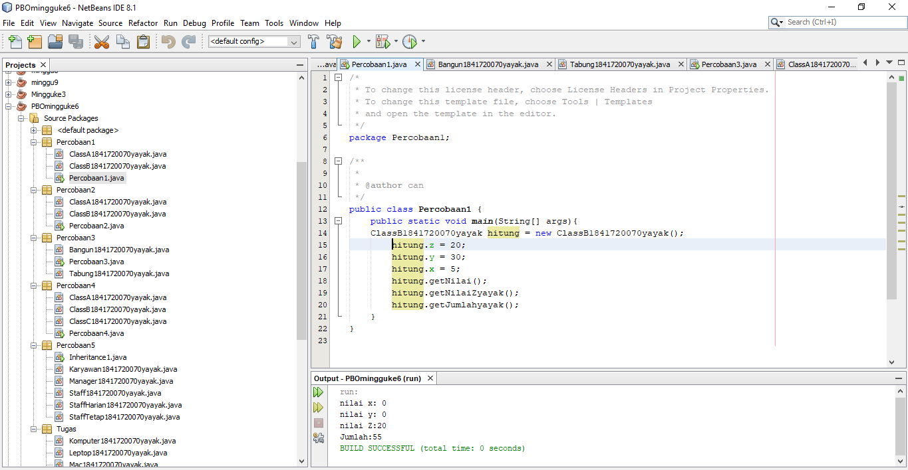
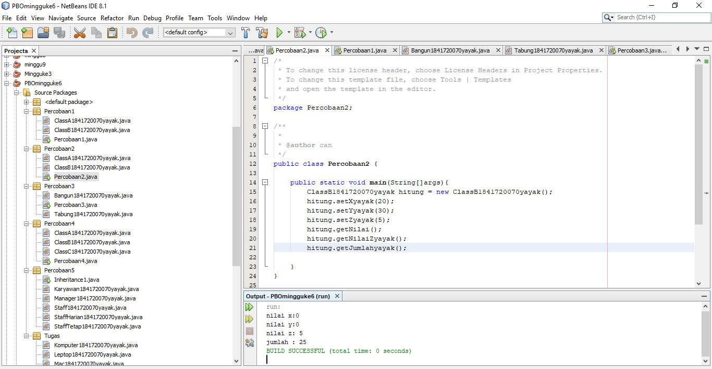
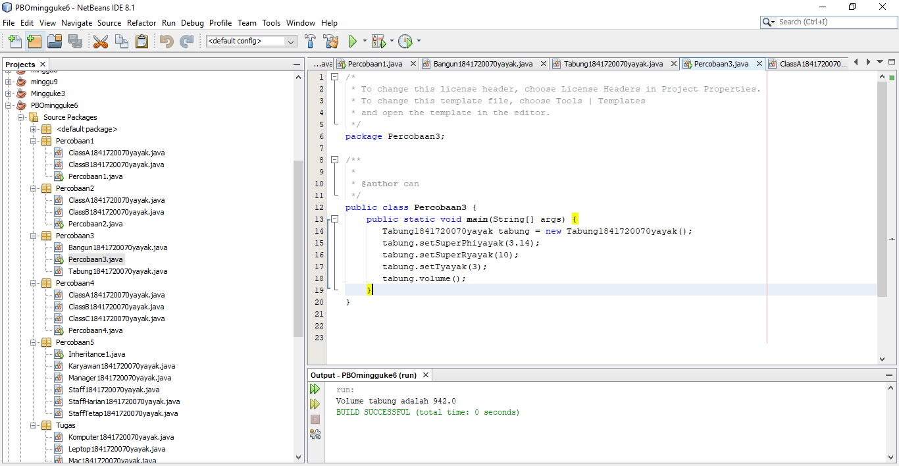
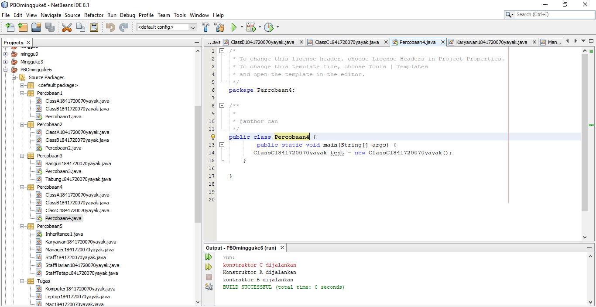
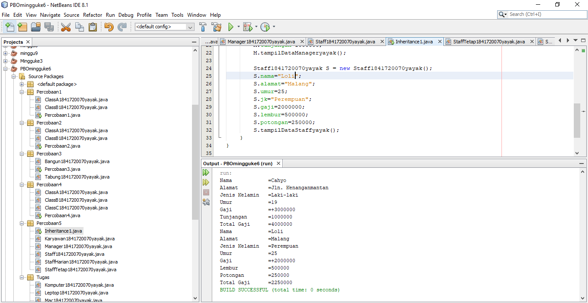
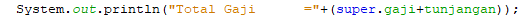
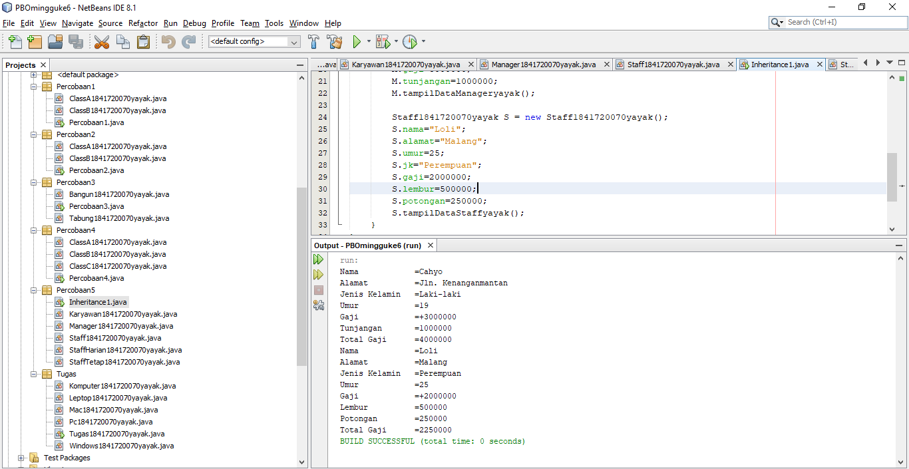
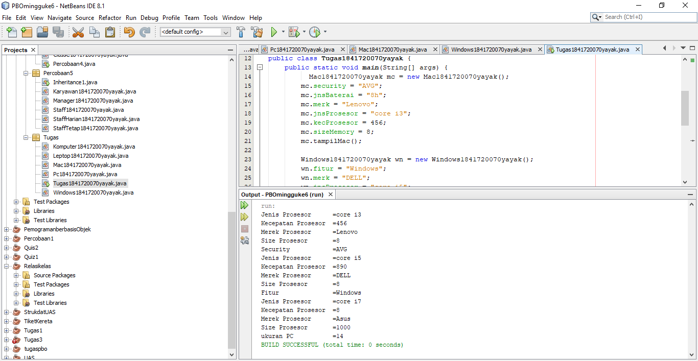

# Laporan Praktikum #6 - Inheritance (Pewarisan)

## Kompetensi

Setelah menempuh pokok bahasan ini, mahasiswa mampu: 
1. Memahami konsep dasar inheritance atau pewarisan.	
2. Mampu membuat suatu subclass dari suatu superclass tertentu	
3. Mampu mengimplementasikan konsep single dan multilevel inheritance.	
4. Mampu membuat objek dari suatu subclass dan melakukan pengaksesan terhadap atribut dan method baik yang dimiliki sendiri atau turunan dari superclassnya.	
  

## Ringkasan Materi

## Percobaan

### Percobaan 1 (extends)

ClassA : [Klik disini](../../src/6_Inheritance/Percobaan1/ClassA1841720070yayak.java)

ClassB : [Klik disini](../../src/6_Inheritance/Percobaan1/ClassB1841720070yayak.java)

Main Class Percobaan 1 : [Klik disini](../../src/6_Inheritance/Percobaan1/Percobaan1.java)

### Pertanyaan

1. Pada	percobaan 1 diatas program yang dijalankan terjadi error, kemudian perbaiki sehingga program tersebut bisa dijalankan dan tidak error!

    Jawab:

    

    ClassA : [Klik disini](../../src/6_Inheritance/Percobaan1/ClassA1841720070yayak.java)

    ClassB : [Klik disini](../../src/6_Inheritance/Percobaan1/ClassB1841720070yayak.java)

    Main Class Percobaan 1 : [Klik disini](../../src/6_Inheritance/Percobaan1/Percobaan1.java)

2. Jelaskan apa penyebab program pada percobaan 1 ketika dijalankan terdapat error!

    Jawab:

    Karena pada ClassB1841720085Falaah belum memiliki fungsi extends yang diarahkan ke ClasA1841720085Falaah sehingga main tidak dapat membaca variable x dan y serta method getNilaiFalaah().

### Percobaan 2 (Hak Akses)

4. Jalankan program diatas, kemudian amati apa yang terjadi!

Bangun : [Klik disini](../../src/6_Inheritance/Percobaan2/ClassA1841720070yayak.java)

Tabung : [Klik disini](../../src/6_Inheritance/Percobaan2/ClassB1841720070yayak.java)

Main Class Percobaan 3 : [Klik disini](../../src/6_Inheritance/Percobaan2/Percobaan2.java)

### Pertanyaan

1. Pada percobaan 2 diatas program yang dijalankan terjadi error, kemudian perbaiki sehingga program tersebut bisa dijalankan dan tidak error!

    Jawab:

    

ClassA : [Klik disini](../../src/6_Inheritance/Percobaan1/ClassA1841720070yayak.java)

ClassB : [Klik disini](../../src/6_Inheritance/Percobaan2/ClassB1841720070yayak.java)

Main Class Percobaan 2 : [Klik disini](../../src/6_Inheritance/Percobaan2/Percobaan2.java)

2. Jelaskan apa penyebab program pada percobaan 2 ketika dijalankan terdapat error!

    Jawab:

    Karena pada ClassB1841720070yayak belum memiliki fungsi extends yang diarahkan ke ClassA1841720070yayak dan modifier di ClassB1841720070yayak adalah protect yang mana hanya bisa diakses di class tersebut, maka itu kita memerlukan fungsi extends untuk mengaksesnya dan melakukan perubahan acces modifier dari variable x dan y dari private menjadi protected

### Percobaan 3 (Super)

4. Jalankan program diatas, kemudian amati apa yang terjadi!

Bangun : [Klik disini](../../src/6_Inheritance/Percobaan3/Bangun1841720070yayak.java)

Tabung : [Klik disini](../../src/6_Inheritance/Percobaan3/Tabung1841720070yayak.java)

Main Class Percobaan 3 : [Klik disini](../../src/6_Inheritance/Percobaan3/Percobaan3.java)

### Pertanyaan

1. Jelaskan fungsi “super” pada potongan program berikut di class Tabung!
  
    Jawab:

    Fungsi super pada potongan program tersebut adalah untuk memanggil atribut tersebut dari class induk/superclass.

2. Jelaskan fungsi “super” dan “this” pada potongan program berikut di class Tabung!	

     

    Jawab:

    Super sendiri menunjukkan bahwa atribut tersebut akan memanggil variable dari class induk/superclass, sedangkan pada this menunjukkan bahwa atribut tersebut akan memanggil variable dari dirinya sendiri/variable yang terdapat pada class tersebut (bukan superclass).

3. Jelaskan mengapa pada class Tabung1841720085Falaah tidak dideklarasikan atribut “phi” dan “r” tetapi class tersebut dapat mengakses atribut tersebut! 

    Jawab:

    Karena class Tabung1841720085Falaah merupakan subclass dari class Bangun1841720085Falaah sehingga atribut yang ada pada tersebut walaupun bersifat protected akan diwariskan pada subclassnya.

### Percobaan 4

Contoh kode program pada class ClassA1841720070yayak.java : [ini link ke kode program](../../src/6_Inheritance/Percobaan4/ClassA1841720070yayak.java)

Contoh kode program pada class ClassB1841720070yayak.java : [ini link ke kode program](../../src/6_Inheritance/Percobaan4/ClassB1841720070yayak.java)

Contoh kode program pada class ClassC1841720070yayak.java : [ini link ke kode program](../../src/6_Inheritance/Percobaan4/ClassC1841720070yayak.java)

Contoh kode program pada main class Percobaan41841720085Falaah.java : [ini link ke kode program](../../src/6_Inheritance/Percobaan4/Percobaan4.java)

### Pertanyaan

1. Pada percobaan 4 sebutkan mana class yang termasuk superclass dan subclass, kemudian jelaskan alasannya!

    Jawab:

    Yang merupakan Superclass adalah ClassA1841720070yayak dan subclassnya adalah ClassB1841720070yayak kenapa bisa begitu ?, karena ClassA1841720070yayak merupakan class induk yang tidak diwarisi oleh class lain namun mewarikan pada class lain sedangkan pada ClassB1841720085Falaah merupakan subclass karena diwariskan dari ClassA1841720070yayak namun bisa dikatakan sebagai superclass juga karena mewariskan pada ClassC1841720070yayak.

2. Ubahlah isi konstruktor default ClassC seperti berikut:	

 

    Tambahkan kata super() di baris	Pertaman dalam konstruktor defaultnya. Coba jalankan kembali class Percobaan4 dan terlihat tidak ada perbeda dari hasil outputnya!

    Jawab:

   

3. Ubahlah isi konstruktor default ClassC seperti berikut:	

      

    Ketika mengubah posisi super() dibaris kedua dalam kontruktor defaultnya dan terlihat ada error. Kemudian kembalikan super() kebaris pertama seperti sebelumnya, maka errornya akan hilang.

      

    Jelaskan bagaimana urutan proses jalannya konstruktor saat objek test dibuat!	  

    Jawab:

    

4. Apakah fungsi super() pada potongan program dibawah ini di ClassC!
    
    Jawab:
digunakan untuk memanggil method ternetu dari kelas induk.
    

### Percobaan 5

Contoh kode program pada class Karyawan1841720070yayak.java : [ini link ke kode program](../../src/6_Inheritance/Percobaan5/Karyawan1841720070yayak.java)

Contoh kode program pada class Manager1841720070yayak.java : [ini link ke kode program](../../src/6_Inheritance/Percobaan5/Manager1841720070yayak.java)

Contoh kode program pada class Staff1841720070yayak.java :
[ini link ke kode program](../../src/6_Inheritance/Percobaan5/Staff1841720070yayak.java)

Contoh kode program pada main class Percobaan4.java :
 [ini link ke kode program](../../src/6_Inheritance/Percobaan5/inheritance1.java)

### Pertanyaan

1. Sebutkan class mana yang termasuk super class dan sub class dari percobaan 1 diatas!	

    Jawab:
Super Class (Karyawan) sedangkan sub Class (Staff, Manager) dengan mengetikkan extends pada classnya dan di ikut i super classnya Karyawan

2. Kata kunci apakah yang digunakan untuk menurunkan suatu class ke class yang lain?

    Jawab:
Yaitu dengan menggunakan Extends untuk menurunkan ke Class yang lainnya

3. Perhatikan kode program pada class Manager, atribut apa saja yang dimiliki oleh class tersebut? Sebutkan atribut mana saja yang diwarisi dari class Karyawan!

    Jawab:
Pada ClassManager terdapat attribut : int Tunjagan 
Attribut pada class Kariyawan : Gaji , yang mana nanti akan di turunkan menjadi Tunjagan pada Class Manager

4. Jelaskan kata kunci super pada potongan program dibawah ini yang terdapat pada class Manager1841720085Falaah!

    

    Jawab:

5. Program pada percobaan 1 diatas termasuk dalam jenis inheritance apa? Jelaskan alasannya!

    Jawab:

Multilevel Inheritance: Suatu sub class yang menjadi parent class untuk class lainnya.

### Percobaan 6

Contoh kode program pada class ClassA1841720070yayak.java :
 [ini link ke kode program](../../src/6_Inheritance/Percobaan5/StaffTetap1841720070yayak.java)

Contoh kode program pada class ClassB1841720070yayak.java :
 [ini link ke kode program](../../src/6_Inheritance/Percobaan5/StaffHarian1841720070yayak.java)

Contoh kode program pada class ClassC1841720070yayak.java :
 [ini link ke kode program](../../src/6_Inheritance/Percobaan5/Inheritance1.java)

Contoh kode program pada main class Percobaan41841720070yayak.java : [ini link ke kode program](../../src/6_Inheritance/Percobaan5/Inheritance1.java)

### Pertanyaan

1. Berdasarkan class diatas manakah yang termasuk single inheritance dan mana yang termasuk multilevel inheritance?

    Jawab:
Single Inheritance : Pada Percobaan 1 ClassA (Class B mewakili Class B , Class Tabung mewakili Class Tabung)
Multilavel inheritance : pada Percobaan4 (Class B,C mewakili Class A, Class Manager, Staff mewakili Class Karyawan, Staffharian, Stafftetap mewakili Class Staff) 

    

2. Perhatikan kode program class StaffTetapArifin dan StaffHarianArifin, atribut apa saja yang dimiliki oleh class tersebut? Sebutkan atribut mana saja yang diwarisi dari class Staff!	
  
    Jawab:
Attribut Class StaffHarian = jumlah jam kerja yang mana attribut ini diwarisi oleh class karyawan (potongan)
Attribut Class StaffTetap = golongan , asuransi yang mana attribut ini diwarisi oleh class karyawan (lembur)

3. Apakah fungsi potongan program berikut pada class StaffHarian

 Jawab:

    untuk memanggil nilai dari dari variabel yang ada di dalam class induk (super class)   

   

4. Apakah fungsi potongan program berikut pada class StaffHarian

    

    Jawab:

Karena pada method tampilDatastaff(); menggunakan kata kunci super untuk mengambil nilai dari variable yang ada di jalam sub class

5. Perhatikan kode program dibawah ini yang terdapat pada class	StaffTetap

    

    Terlihat dipotongan program diatas atribut gaji, lembur dan potongan dapat diakses langsung. Kenapa hal ini bisa terjadi dan bagaimana class StaffTetap memiliki atribut gaji, lembur, dan potongan padahal dalam class tersebut tidak dideklarasikan atribut gaji, lembur, dan potongan?

Jawab:

Karena pada class StaffTetap kita menggunakan extands untuk memanggil isi yang terdapat di 
	dalam Class Staf yang mana isinya atribut gaji, lembur, dan potongan

    

## Tugas

Contoh link kode program pada class Komputer1841720070yayak.java : [ini contoh link ke kode program](../../src/6_Inheritance/Tugas/Komputer1841720070yayak.java)

Contoh link kode program pada class Leptop1841720070yayak.java : [ini contoh link ke kode program](../../src/6_Inheritance/Tugas/Leptop1841720070yayak.java)

Contoh link kode program pada class Mac1841720070yayak.java : [ini contoh link ke kode program](../../src/6_Inheritance/Tugas/Mac1841720070yayak.java)

Contoh link kode program pada class Pc1841720070yayak.java : [ini contoh link ke kode program](../../src/6_Inheritance/Tugas/Pc1841720070yayak.java)

Contoh link kode program pada class main Tugas1841720070yayak : [ini contoh link ke kode program](../../src/6_Inheritance/Tugas/Tugas1841720070yayak.java)

Contoh link kode program pada classWindows1841720070yayak.java : [ini contoh link ke kode program](../../src/6_Inheritance/Tugas/Windows1841720070yayak.java)

## Kesimpulan

hubungan antar kelas dan berpacu pada diagram karena disana bagaikan petunjuk yang harus diselesaikan

## Pernyataan Diri

Saya menyatakan isi tugas, kode program, dan laporan praktikum ini dibuat oleh saya sendiri. Saya tidak melakukan plagiasi, kecurangan, menyalin/menggandakan milik orang lain.

Jika saya melakukan plagiasi, kecurangan, atau melanggar hak kekayaan intelektual, saya siap untuk mendapat sanksi atau hukuman sesuai peraturan perundang-undangan yang berlaku.

Ttd,

***(Cahya Abdillah)***