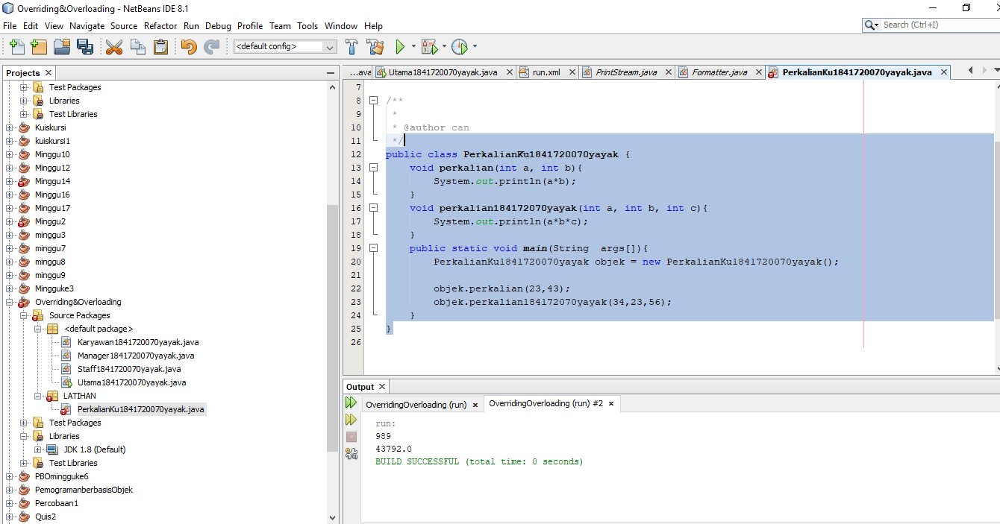

# Laporan Praktikum #6 - Inheritance (Pewarisan)

## Kompetensi

Setelah menempuh pokok bahasan ini, mahasiswa mampu: 
1. Memahami konsep dasar inheritance atau pewarisan.	
2. Mampu membuat suatu subclass dari suatu superclass tertentu	
3. Mampu mengimplementasikan konsep single dan multilevel inheritance.	
4. Mampu membuat objek dari suatu subclass dan melakukan pengaksesan terhadap atribut dan method baik yang dimiliki sendiri atau turunan dari superclassnya.	
  

## Ringkasan Materi
 Overriding  adalah Sublass yang berusaha memodifkasi tingkah laku yang diwarisi dari superclass. Tujuannya subclass dapat memiliki tingkah laku yang lebih spesifik sehingga dapat dilakukan dengan cara mendeklarasikan kembali method milik parent class di subclass. Deklarasi method pada subclass harus sama dengan yang terdapat di super class. Kesamaan pada:  Nama  Return type (untuk return type : class A atau merupakan subclass dari class A)  Daftar parameter (jumlah, tipe dan urutan) 
Sehingga method pada parent class disebut overridden method dan method pada subclass disebut overriding method. Ada beberapa aturan method didalam overriding: 
 Mode akses overriding method harus sama atau lebih luas dari pada overridden method.  Subclass hanya boleh meng-override method superclass satu kali saja, tidak boleh ada lebih dari satu method pada kelas yang sama persis. 
 Overriding method tidak boleh throw checked exceptions yang tidak dideklarasikan oleh overridden method. 
 

## Percobaan

### Percobaan 

 Karyawan1841720070yayak: [Klik disini](../../src/7_Overriding_dan_Overloading/Percobaan/Karyawan1841720070yayak.java)

Manager1841720070yayak : [Klik disini](../../src/7_Overriding_dan_Overloading/Percobaan/Manager1841720070yayak.java)

Staff1841720070yayak : [Klik disini](../../src/7_Overriding_dan_Overloading/Percobaan/Staff1841720070yayak.java)

Utama1841720070yayak : [Klik disini](../../src/7_Overriding_dan_Overloading/Percobaan/Utama1841720070yayak.java)

### Latihan

PerkalianKu1841720070yayak : [Klik disini](../../src/7_Overriding_dan_Overloading/LATIHAN/PerkalianKu1841720070yayak.java)
    
4.1 Dari source coding diatas terletak dimanakah overloading? 

 Jawab :  Terdapat  method overloading yaitu terdapat pada baris syntax ke 4, pada method perkalian di class Perkalianku 

 

4.2 Jika terdapat overloading ada berapa jumlah parameter yang berbeda?

Jawab:  parameter yang berbeda berjumlah 1 yaitu pada method perkalian yang pertama berparameter (int a, int b). Sedangkan method perkalian yang kedua (overloading) berparameter (int a, int b, int c) 
    
  

  
  PerkalianKu1841720070yayak : [Klik disini](../../src/7_Overriding_dan_Overloading/LATIHAN/PerkalianKu1841720070yayak.java)

4.3 Dari source coding diatas terletak dimanakah overloading? 

 Jawab : Terdapat  method overloading yaitu terdapat pada baris syntax ke 4

4.4 Jika terdapat overloading ada berapa tipe parameter yang berbeda?

Jawab :  ada 1 tipe parameter berbeda, yang method pertama menggunakan tipe parameter integer, sedangkan pada method kedua (overloading) menggunakan tipe parameter double, meskipun samasama berjumlah 2 parameter 

Ikan1841720070yayak : [Klik disini](../../src/7_Overriding_dan_Overloading/LATIHAN/Ikan1841720070yayak.java)

 Piranha1841720070yayak : [Klik disini](../../src/7_Overriding_dan_Overloading/LATIHAN/Piranha1841720070yayak.java)
    

4.5 Dari source coding diatas terletak dimanakah overriding? 

Jawab : 
(img/J1.PNG)

terletak ada baris syntax ke 7, yaitu pada method swim() di class Piranha 
 
4.6 Jabarkanlah apabila sourcoding diatas jika terdapat overriding?

Jawab :  Terdapat overriding, yaitu pada method swim() di class Piranha. Disebut method overriding karena nama method tersebut sama dengan  nama method di superclass nya, akan tetapi berbeda di isi methodnya (dimodifikasi) 

### TUGAS
 
##### 5.1 Overloading 

TI_Main1841720070yayak : [Klik disini](../../src/7_Overriding_dan_Overloading/TUGAS/TI_Main1841720070yayak.java)

 T11841720070yayak : [Klik disini](../../src/7_Overriding_dan_Overloading/TUGAS/T11841720070yayak.java)

Dosen1841720070yayak : [Klik disini](../../src/7_Overriding_dan_Overloading/TUGAS/Dosen1841720070yayak.java)

Mahasiswa1841720070yayak : [Klik disini](../../src/7_Overriding_dan_Overloading/TUGAS/Mahasiswa1841720070yayak.java)

MainManusia1841720070yayak : [Klik disini](../../src/7_Overriding_dan_Overloading/TUGAS/MainManusia1841720070yayak.java)

Manusia1841720070yayak : [Klik disini](../../src/7_Overriding_dan_Overloading/TUGAS/Manusia1841720070yayak.java)

## Kesimpulan

OverLoading
OverLoading adalah membuat 2 atau lebih method dengan nama yang sama dalam satu class tetapi method – method tersebut harus dapat dibedakan antara satu dengan yang lainnya, baik dalam jumlah parameter maupun tipe parameter.

OverRiding
OverRiding adalah kemampuan class anak untuk memodifikasi atau mendefenisikan kembali variable dan method dari class induknya. Proses ini akan dirubah variable dan method dari kedua class tersebut (class induk dan class anak).
Ada 2 alasan mengapa melakukan OverRiding :
a. Mendefenisikan kembali method class induk secara total
b. Menambahkan kembali behaviour tertentu pada method class induk.
## Pernyataan Diri

Saya menyatakan isi tugas, kode program, dan laporan praktikum ini dibuat oleh saya sendiri. Saya tidak melakukan plagiasi, kecurangan, menyalin/menggandakan milik orang lain.

Jika saya melakukan plagiasi, kecurangan, atau melanggar hak kekayaan intelektual, saya siap untuk mendapat sanksi atau hukuman sesuai peraturan perundang-undangan yang berlaku.

Ttd,

***(Cahya Abdillah)***