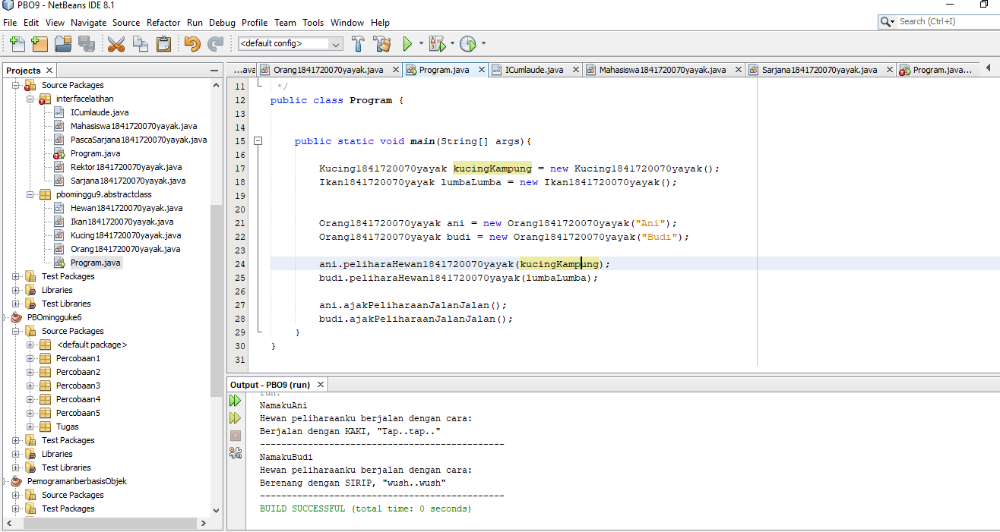
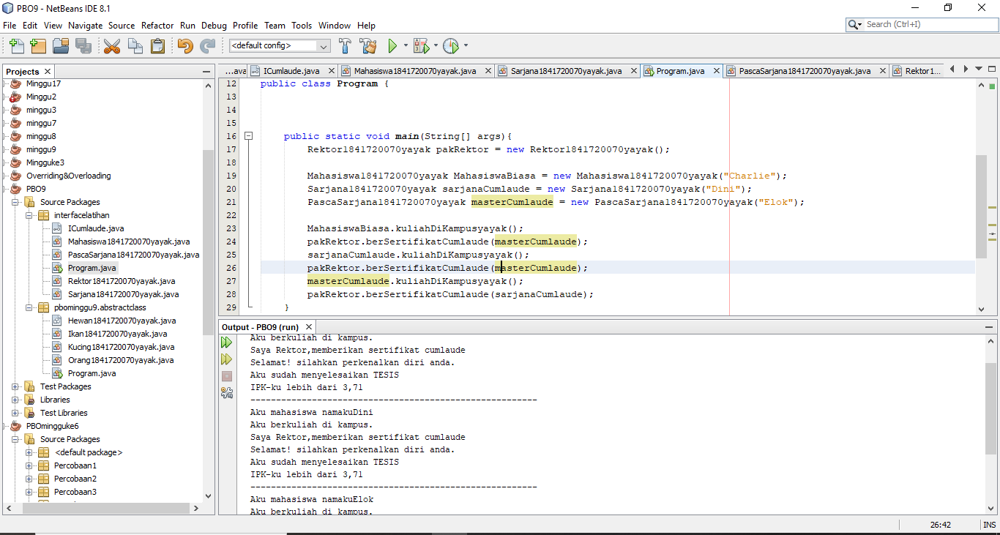
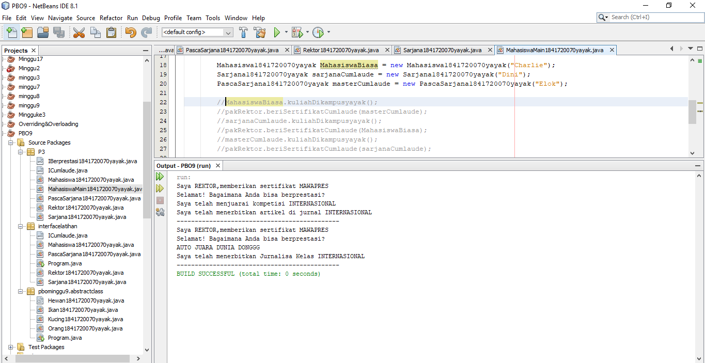

# Laporan Praktikum #9 - Abstract Class dan Interface

# Kompetensi
Setelah menyelesaikan lembar kerja ini mahasiswa diarapkan mampu:

Menjelaskan maksud dan tujuan penggunaan Abstract Class
Menjelaskan maksud dan tujuan penggunaan Interface
Menggunakan Abstract Class dan Interface di dalam pembuatan program
# Ringkasan Materi
Pada praktikum ini saya mengalami kesulitan konsep class abstract, untuk solusi dari permasalahan yang saya alami dapat diselesaikan dengan lebih belajar lagi.

# Percobaan

# Percobaan 1
Pada percobaan pertama saya membuat empat buah class, yang pertama bernama Hewan1841720070yayak yang memiliki atribut nama dengan tipe data String selain itu terdapat konstruktor dan method bertambahUmuryayak() dan bergerakyayak. Kedua adalah class dengan nama Kucing1841720070yayak yang merupakan turunan dari Hewan1841720070yayak dan memiliki method bergerakyayak(). Yang ketiga adalah class dengan nama Ikan1841720070yayak yang merupakan Hewan1841720070yayak dan memiliki method bergerakyayak(). Yang terakhir adalah saya membuat class bernama Orang1841720070yayak yang memiliki atribut nama dengan tipe data String dan hewanPeliharaan yang memiliki tipe data dari class Hwane1841720070yayak, selain atribut terdapat konstruktor berparameter atribut nama dan juga terdapat method peliharaanHewanyayak() dan ajakPeliharaanJalanJalanyayak() untuk menampilkan value pada atribut nama dan juga untuk menampilkan value pada ethod bergerakyayak() yang tersambung pada atribut hewanPeliharaan.

Hewan1841720070yayak: [Klik disini](../../src/9_Abstract_Class_dan_Interface/Hewan1841720070yayak.java)

Ikan1841720070yayak: [Klik disini](../../src/9_Abstract_Class_dan_Interface/Ikan1841720070yayak.java)

Kucing1841720070yayak: [Klik disini](../../src/9_Abstract_Class_dan_Interface/Kucing1841720070yayak.java)

Orang1841720070yayak: [Klik disini](../../src/9_Abstract_Class_dan_Interface/Orang1841720070yayak.java)

Program: [Klik disini](../../src/9_Abstract_Class_dan_Interface/Program.java)

# Pertanyaan
Bolehkah apabila sebuah class yang meng-extend suatu abstract class tidak mengimplementasikan method abstract yang ada di class induknya? Buktikan!

Jawab:

Tidak boleh, karena kelas turunan harus mengoverride method yang ada dari kelas parent dan bila tidak maka akan muncul error, misalnya di kelas Kucing1841720128Yayak dihapus method bergerakYayak(), makan akan muncul error.

# Percobaan 2
Pada percobaan kedua saya membuat satu buah interface dan empat buah class, yang pertama bernama Icumlaude1841720128Arifin yang merupakan interface dan memiliki method lulusyayak() dan meraihIPKTinggiyayak(). Kedua adalah class dengan nama Mahasiswa1841720128yayak yang memiliki atribut bernama nama dengan tipe data String, selain atribut terdapat konstruktor berparameter satu dan method kuliahDiKampusyayak() untuk menampilkan value dari atribut nama. Yang ketiga adalah class dengan nama Sarjana1841720070yayak yang merupakan turunan dari Mahasiswa1841720070yayak dan implemen dari Icumlaude1841720070yayak, selain itu terdapat konstruktor Sarjana1841720070yayak untuk memanggil atribut nama dari parent class dan terdapat dua method yaitu lulusyayak() dan meraihIPKTinggiyayak(). Ketiga adalah class PascaSarjana1841720070yayak yang merupakan child class dari Mahasiswa dan implement dari Icumlaude1841720070yayak dan konstruktor PascaSarjana yang memanggil atribut nama dari parent classnya selain itu, terdapat method lulusyayak() dan juga method bernama meraihIPKTinggiyayak(). Keempat adalah class dengan nama Rektor1841720070yayak yang memiliki method beriSertifikatCumlaudeyayak yang menampilkan hasil pada method lulusyayak() dan meraihIPKTinggiyayak(). Yang terakhir adalah saya membuat main class bernama Programtest1841720070yayak.

ICumlaude: [Klik disini](../../src/9_Abstract_Class_dan_Interface/Percobaan2/ICumlaude.java)

Program: [Klik disini](../../src/9_Abstract_Class_dan_Interface/Percobaan2/Program.java)

Mahasiswa1841720070yayak: [Klik disini](../../src/9_Abstract_Class_dan_Interface/Percobaan2/Mahasiswa1841720070yayak.java)

PascaSarjana1841720070yayak: [Klik disini](../../src/9_Abstract_Class_dan_Interface/Percobaan2/PascaSarjana1841720070yayak.java)

Rektor1841720070yayak: [Klik disini](../../src/9_Abstract_Class_dan_Interface/Percobaan2/Rektor1841720070yayak.java)

Sarjana1841720070yayakk: [Klik disini](../../src/9_Abstract_Class_dan_Interface/Percobaan2/Sarjana1841720070yayak.java)

# Pertanyaan

Mengapa pada langkah nomor 9 terjadi error? Jelaskan!

Jawab:

Karena pada class Mahasiswa1841720070yayak tidak ter-implementasi interfaces dari Icumlaude1841720070yayak sehingga error ketika akan dipanggil oleh object pakRektor.

Dapatkah method kuliahDiKampus() dipanggil dari objek sarjanaCumlaude di class Program? Mengapa demikian?

Jawab:

Bisa, karena object sarjanaCumlaude dari class Sarjana1841720070yayak adalah kelas turunan dari Mahasiswa1841720070yayak, sehingga method kuliahDiKampusArifin() bisa dipanggil ke class Sarjana1841720070yayak.

Dapatkah method kuliahDiKampus() dipanggil dari parameter mahasiswa di method beriSertifikatCumlaude() pada class Rektor? Mengapa demikian?

Jawab:

Tidak bisa, karena class Rektor1841720070yayak hanya menggunakan implementasi dari Icumlaude1841720070yayak, dan method kuliahDiKampusyayak() dari class Mahasiswa1841720070yayak tidak pernah di inisiasi di class Rektor1841720070yayak.

Modifikasilah method beriSertifikatCumlaude() pada class Rektor agar hasil eksekusi class Program menjadi seperti berikut:

# Percobaan 3

Pada percobaan ketiga saya membuat satu buah class interface bernama Iberprestasi1841720070yayak karena pada percobaan 3 ini masih berhubungan dengan percobaan 3, yang berisi method menjuaraiKompetisiyayak() dan membuatPublkasiIlmiahyayak(). dan pada class PacsaSarjana1841720070yayak menambahkan satu implement lagi yaitu Iberprestasi1841720070yayak maka dan akan menambahkan dua method lagi yaitu menjuaraiKompetisiyayak() dan membuatPublkasiIlmiahyayak(). Selain itu pada class Rektor1841720070yayak menambahkan method dengan nama beriSertifikatMawapresyayak() yang digunakan untuk menampilkan value pada method menjuaraiKompetisiyayak() dan membuatPublkasiIlmiahyayak().

ICumlaude: [Klik disini](../../src/9_Abstract_Class_dan_Interface/Percobaan3/ICumlaude.java)

IBerprestasi1841720070yayak: [Klik disini](../../src/9_Abstract_Class_dan_Interface/Percobaan3/IBerprestasi1841720070yayak.java)

Mahasiswa1841720070yayak: [Klik disini](../../src/9_Abstract_Class_dan_Interface/Percobaan3/Mahasiswa1841720070yayak.java)

PascaSarjana1841720070yayak: [Klik disini](../../src/9_Abstract_Class_dan_Interface/Percobaan3/PascaSarjana1841720070yayak.java)

MahasiswaMain1841720070yayak: [Klik disini](../../src/9_Abstract_Class_dan_Interface/Percobaan3/MahasiswaMain1841720070yayak.java)

Rektor1841720070yayak: [Klik disini](../../src/9_Abstract_Class_dan_Interface/Percobaan3/Rektor1841720070yayak.java)

Sarjana1841720070yayak: [Klik disini](../../src/9_Abstract_Class_dan_Interface/Percobaan3/Sarjana1841720070yayak.java)

# Pertanyaan
Apabila Sarjana Berprestasi harus menjuarai kompetisi NASIONAL dan menerbitkan artikel di jurnal NASIONAL, maka modifikasilah class-class yang terkait pada aplikasi Anda agar di class Program objek pakRektor dapat memberikan sertifikat mawapres pada objek sarjanaCumlaude

# Kesimpulan
Hal yang dapat saya simpulkan dari praktikum yang telah dilakukan adalah Abstract Class yang merupakan class yang tidak dapat diinstansiasi namun dapat di-extend selain hal tersebut interface juga berperan penting dalam pembuatan abstract class tersebut.

# Pernyataan Diri
Saya menyatakan isi tugas, kode program, dan laporan praktikum ini dibuat oleh saya sendiri. Saya tidak melakukan plagiasi, kecurangan, menyalin/menggandakan milik orang lain.

Jika saya melakukan plagiasi, kecurangan, atau melanggar hak kekayaan intelektual, saya siap untuk mendapat sanksi atau hukuman sesuai peraturan perundang-undangan yang berlaku.

Ttd,

***(Cahya Abdillah)***